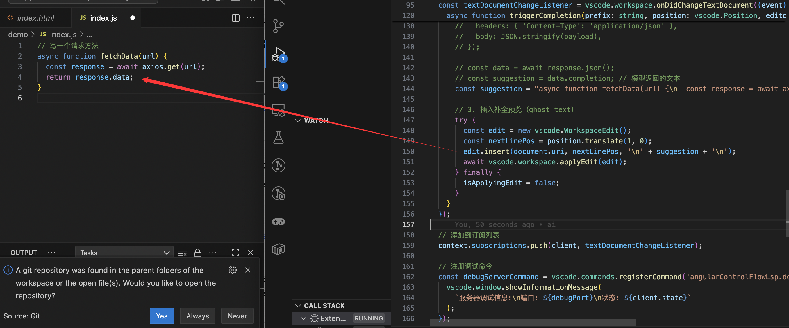

### AI Coding 辅助的实现原理
—— 从输入事件到智能补全的完整链路

AI 编码助手（Copilot / Cody / Tabnine 等）看似神奇，实际上背后是一套清晰的技术管线。
理解这套机制，有助于我们自己构建类似的智能补全系统，或在插件中嵌入 AI 能力。

#### 一、系统总览：四层架构
AI Coding 辅助系统一般可拆分为四层：
┌──────────────────────────────┐
│      编辑器插件层 (VSCode)   │ ← 捕获输入、展示补全
├──────────────────────────────┤
│      通信与代理层 (Agent)    │ ← 封装请求、上下文管理
├──────────────────────────────┤
│      模型服务层 (LLM API)    │ ← 接收 prompt，生成代码
├──────────────────────────────┤
│      上下文检索层 (Context)  │ ← 提取项目相关代码
└──────────────────────────────┘

#### 二、编辑器插件层：触发与上下文收集

##### 1. 捕获用户输入
插件会监听 VS Code 的事件：
```js
vscode.workspace.onDidChangeTextDocument(event => {
  const position = event.contentChanges[0].range.start;
  const prefix = getPrefix(event.document, position);
  triggerCompletion(prefix, position);
});

```
当检测到输入（如空格、回车、点号）时，就会触发补全请求。
##### 2. 构造 Prompt
插件根据当前文件、光标位置，提取上下文信息
```js
{
  "language": "typescript",
  "filename": "user.service.ts",
  "beforeCursor": "function getUser(id: number) {",
  "afterCursor": "",
  "projectContext": [
    "import axios from 'axios';",
    "export class UserService { ... }"
  ]
}
```
这些内容会拼接成模型的 Prompt，用于指导生成。

##### 三、通信与代理层：连接模型与 IDE
编辑器不会直接调用大模型 API，而是通过一个中间 Agent（也叫 Proxy Service）。
比如：

- Copilot 的 “copilot-agent”

- Cody 的 “cody-agent”

- Tabnine 的 “tabnine local agent”

Agent 的作用：

鉴权与配额控制
验证用户 token，限制调用频率。

上下文拼接与裁剪

合并当前文件、同目录文件、历史编辑记录；

控制总 token 数（比如 8k 或 32k）。

请求模型 API
```js
const response = await fetch('https://copilot-proxy/api/v1/completions', {
  method: 'POST',
  headers: { Authorization: 'Bearer TOKEN' },
  body: JSON.stringify(prompt),
});
```

返回结果与后处理

- 清理缩进、转义符号

- 给每个候选项添加置信度评分

- 发送回插件显示

#### 四、模型服务层：语义理解与代码生成
1. 模型架构

大多数 AI 补全模型都是基于 Transformer 解码器（Decoder-only）架构：

- Copilot：OpenAI Codex / GPT-4 Turbo

- Cody：Claude 3 / Sourcegraph 自研模型

- Tabnine：GPT-J + 自有微调

这些模型在大量开源代码上预训练（GitHub、StackOverflow、Docs），
学习到 token 序列的分布模式 与 语义模式。

2. 推理过程（Inference Pipeline）
 2.1. 编码输入 Prompt
Prompt 例如：
```js
# Language: js
function fetchData(url) {
  const response = await axios.get(url);
  return response.data;
}
```
被编码为 tokens。
  2.2. 预测下一个 token
模型预测下一个最可能出现的 token，直到生成完整函数体。
   2.3. 输出结构化结果
模型返回：
```js
{
  "text": "async function fetchData(url) {\n  const response = await axios.get(url);\n  return response.data;\n}",
  "confidence": 0.95,
  "finish_reason": "stop",
  "tokens": 45
}
```
#### 五、上下文检索层：跨文件语义理解的关键
现代 AI 补全系统不只看单文件，还能理解整个项目结构。
这依赖于 代码语义索引（Code Embedding Index）。
##### 工作流程

1.预先为每个文件生成向量表示（embedding）

2. 根据当前编辑位置，检索最相关的代码块

3. 将这些代码片段拼接到模型 Prompt 前
   例如 Prompt = 当前文件 + 相似函数 + 相关文档 + 用户问题
   这使模型能“读懂”项目上下文，生成更准确的结果。

#### 六、编辑器端插入结果与人机协作
返回结果后，插件会：

1. 计算补全文本的插入范围；

2. 渲染成灰色预览（ghost text）；

3. 允许用户 Tab 接受或 Esc 拒绝。
##### VS Code 的 API 示例：

```js
const edit = new vscode.TextEdit(
  new vscode.Range(position, position),
  completion.text
);
editor.insertSnippet(new vscode.SnippetString(edit.newText));

```

#### 七、性能与安全考量
- 延迟优化：通常要求 100–300ms 内返回结果 → 本地缓存 + token 预测并行。

- 代码隐私：企业环境会通过本地部署（Tabnine Local）或 Proxy 过滤敏感内容。

- 上下文剪枝：防止大文件超出 token 限制。

#### 八、从输入到补全的一次完整调用链

- 用户输入字符 →
- VSCode 插件捕获事件 →
- 构造上下文 prompt →
- 发送到 agent →
- agent 拼接上下文并鉴权 →
- 调用大模型推理 →
- 模型生成代码补全 →
- agent 返回结果 →
- 插件在编辑器中渲染预览

#### 主要代码
1. 监听用户输入

```js

vscode.workspace.onDidChangeTextDocument((event) => {
        if (isApplyingEdit)
            return; // 如果正在应用编辑，跳过处理
        const document = event.document;
        const editor = vscode.window.activeTextEditor;
        if (!editor)
            return;
        const position = event.contentChanges[0].range.start;
        const prefix = getPrefix(document, position);
        function getPrefix(document, position) {
            const line = document.lineAt(position.line).text;
            return line.slice(0, position.character);
        }
        function shouldTrigger(prefix) {
            // 判断是否需要触发 AI 补全，比如输入 "."、"("、回车等
            return /\.$|\($|\s$/.test(prefix);
        }
        // 当输入触发条件满足时（比如输入 . 或回车）
        if (shouldTrigger(prefix)) {
            isApplyingEdit = true;
            triggerCompletion(prefix, position, editor);
        }
        async function triggerCompletion(prefix, position, editor) {
            const document = editor.document;
            const fileContent = document.getText();
            // 1. 构造请求体（上下文 + 光标位置）
            const payload = {
                language: document.languageId,
                prefix,
                fileContent,
                cursorPosition: document.offsetAt(position),
            };
            console.log("🚀 触发补全请求:", payload);
            console.log("调用 API 返回代码补全功能尚未实现，以下为伪代码示例。");
            // 2. 调用后端 AI 服务（类似 Copilot 的代理）
            // const response = await fetch('http://localhost:3000/api/completion', {
            //   method: 'POST',
            //   headers: { 'Content-Type': 'application/json' },
            //   body: JSON.stringify(payload),
            // });
            // const data = await response.json();
            // const suggestion = data.completion; // 模型返回的文本
            const suggestion = "async function fetchData(url) {\n  const response = await axios.get(url);\n  return response.data;\n}"; // 模型返回的文本
            // 3. 插入补全预览（ghost text）
            try {
                const edit = new vscode.WorkspaceEdit();
                const nextLinePos = position.translate(1, 0);
                edit.insert(document.uri, nextLinePos, '\n' + suggestion + '\n');
                await vscode.workspace.applyEdit(edit);
            }
            finally {
                isApplyingEdit = false;
            }
        }
    })

```


