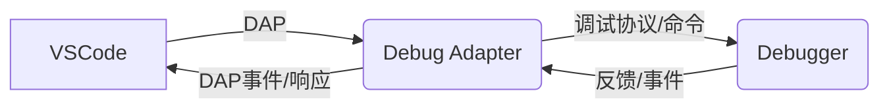

# VS Code Debug Adapter Protocol (DAP)

## 1. 什么是 Debug Adapter Protocol

### VSCode 为什么要设计 DAP
在 VSCode 诞生之初，调试器的实现高度依赖于具体语言和平台，导致扩展性差、维护成本高。为了解耦编辑器与调试器，微软提出了 Debug Adapter Protocol（DAP），让调试器开发者只需实现标准协议即可被 VSCode 及其他 IDE 复用。

### DAP 解决什么问题
- 统一调试协议，屏蔽底层差异
- 降低调试器开发门槛
- 支持多语言、多平台
- 让 IDE 与调试器解耦，便于维护和扩展

### VSCode Debug Architecture
VSCode 的调试架构分为四层：
1. VSCode（IDE）
2. Debug Client（调试前端）
3. Debug Adapter（协议适配层）
4. Debugger（具体调试器）

---

## 2. VSCode Debug 架构解析

### 主要组件说明
- **VSCode**：编辑器本体，负责 UI 展示、用户交互。
- **Debug Client**：VSCode 内部调试前端，负责协议消息的发送与接收。
- **Debug Adapter**：协议适配层，实现 DAP，连接 Debug Client 与 Debugger。
- **Debugger**：具体语言的调试器，如 Node.js、Python、GDB 等。

### 架构流程图



### 通信流程说明
1. VSCode 通过 DAP 向 Debug Adapter 发送调试请求（如启动、断点等）
2. Debug Adapter 解析请求，调用底层 Debugger 执行操作
3. Debugger 返回结果，Adapter 转换为 DAP 响应/事件
4. VSCode 根据响应更新 UI

---

## 3. VSCode Debug 生命周期

调试会话的生命周期大致如下：

1. **initialize**
	 - VSCode 启动调试会话，发送 initialize 请求，协商能力。
2. **launch**
	 - 启动被调试程序（或 attach 到已运行进程）。
3. **setBreakpoints**
	 - 设置断点，VSCode 发送断点信息。
4. **configurationDone**
	 - 通知 Adapter 配置已完成，可以开始调试。
5. **threads**
	 - 查询当前线程信息。
6. **stackTrace**
	 - 查询当前线程的调用栈。
7. **continue**
	 - 继续执行程序。

### 生命周期流程说明
每一步都对应 DAP 的 request/response，VSCode 通过这些步骤完成调试会话的初始化、断点设置、程序控制等。

---

## 4. 实现一个最简单的 Debug Adapter

实现一个最简单的 Fake Debug Adapter，演示 DAP 的基本流程。

### 依赖
需要用到官方包：
- `vscode-debugadapter`
- `vscode-debugprotocol`

安装命令：
```bash
npm install vscode-debugadapter vscode-debugprotocol
```

### Fake Debug Adapter 主要功能
- 支持 launch、setBreakpoints、stackTrace、continue

### 关键代码（adapter/debugAdapter.ts）
```js
const {
	DebugSession,
	InitializedEvent,
	StoppedEvent,
	Thread,
	StackFrame,
	Source
} = require('vscode-debugadapter');
const { DebugProtocol } = require('vscode-debugprotocol');

class FakeDebugSession extends DebugSession {
	constructor() {
		super();
		this._breakPoints = [];
	}

	initializeRequest(response, args) {
		response.body = response.body || {};
		response.body.supportsConfigurationDoneRequest = true;
		this.sendResponse(response);
		this.sendEvent(new InitializedEvent());
	}

	launchRequest(response, args) {
		this.sendResponse(response);
		// 启动后立即停在第一行
		this.sendEvent(new StoppedEvent('entry', 1));
	}

	setBreakPointsRequest(response, args) {
		this._breakPoints = args.breakpoints || [];
		response.body = {
			breakpoints: this._breakPoints.map(bp => ({
				verified: true,
				line: bp.line
			}))
		};
		this.sendResponse(response);
	}

	stackTraceRequest(response, args) {
		const frames = [
			new StackFrame(1, 'main', new Source('fake.js', 'fake.js'), 1, 1)
		];
		response.body = {
			stackFrames: frames,
			totalFrames: frames.length
		};
		this.sendResponse(response);
	}

	continueRequest(response, args) {
		this.sendResponse(response);
		// 直接结束调试
		this.sendEvent(new StoppedEvent('end', 1));
	}
}

DebugSession.run(FakeDebugSession);
```

---

## 5. Demo 项目结构

假设项目结构如下：

```text
demo-dap/
 ├─ package.json
 ├─ extension.ts
 ├─ adapter/
 │   └─ debugAdapter.ts
 ├─ src/
 │   └─ simpleRuntime.ts
 └─ .vscode/
		 └─ launch.json
```

### 各文件作用
- **package.json**：项目依赖与启动脚本
- **extension.ts**：VSCode 插件入口，注册 Debug Adapter
- **adapter/debugAdapter.ts**：Fake Debug Adapter 实现
- **src/simpleRuntime.ts**：可选，模拟运行时逻辑
- **.vscode/launch.json**：调试配置

---

## 6. Debug Adapter 代码实现

下面详细讲解 FakeDebugSession 的关键方法：

### DebugSession
继承自 vscode-debugadapter 的 DebugSession，负责处理所有 DAP 消息。

### setBreakPointsRequest
设置断点，记录断点信息并返回给 VSCode。
```js
setBreakPointsRequest(response, args) {
	this._breakPoints = args.breakpoints || [];
	response.body = {
		breakpoints: this._breakPoints.map(bp => ({
			verified: true,
			line: bp.line
		}))
	};
	this.sendResponse(response);
}
```

### stackTraceRequest
返回当前线程的调用栈。
```js
stackTraceRequest(response, args) {
	const frames = [
		new StackFrame(1, 'main', new Source('fake.js', 'fake.js'), 1, 1)
	];
	response.body = {
		stackFrames: frames,
		totalFrames: frames.length
	};
	this.sendResponse(response);
}
```

### continueRequest
继续执行，演示直接结束调试。
```js
continueRequest(response, args) {
	this.sendResponse(response);
	this.sendEvent(new StoppedEvent('end', 1));
}
```

---

## 7. VSCode Extension 如何启动 Debug Adapter

VSCode 通过注册 DebugAdapterDescriptorFactory 启动 Debug Adapter。

**extension.ts 示例：**
```ts
import * as vscode from 'vscode';
import * as path from 'path';

export function activate(context: vscode.ExtensionContext) {
	context.subscriptions.push(
		vscode.debug.registerDebugAdapterDescriptorFactory('fake-debug', {
			createDebugAdapterDescriptor(session) {
				const adapter = path.join(context.extensionPath, 'adapter', 'debugAdapter.js');
				return new vscode.DebugAdapterExecutable('node', [adapter]);
			}
		})
	);
}
```

这样 VSCode 启动调试时会以子进程方式运行 debugAdapter.js。

---

## 8. launch.json 示例

```json
{
	"version": "0.2.0",
	"configurations": [
		{
			"type": "fake-debug",
			"request": "launch",
			"name": "Fake Debug Launch",
			"program": "${file}"
		}
	]
}
```

---

## 9. 运行 Demo

1. 安装依赖
	 ```bash
	 npm install
	 ```
2. 编译代码（如用 TypeScript）
	 ```bash
	 npm run compile
	 ```
3. 按 F5 启动 Extension Host
4. 选择 Fake Debug 配置，点击运行

---

## 10. 常见 Debug Adapter

- **Node Debug**：VSCode 官方 Node.js 调试器
- **Python Debug**：微软 Python 扩展调试器
- **Go Debug**：Go 官方调试器（基于 Delve）
- **Java Debug**：微软 Java 扩展调试器

---

## 11. 总结

Debug Adapter Protocol（DAP）极大解耦了 IDE 与调试器的关系，推动了多语言、多平台调试体验的标准化。通过实现 DAP，开发者可让自己的调试器被 VSCode 及其他支持 DAP 的 IDE 复用，极大提升了生态兼容性和开发效率。

**核心价值：**
- 解耦 VSCode 和 Debugger
- 支持多语言
- 标准协议，易于扩展

---

## 12. 参考资料

- [Debug Adapter Protocol 官方文档](https://microsoft.github.io/debug-adapter-protocol/)
- [VSCode 官方文档](https://code.visualstudio.com/api/extension-guides/debugger-extension)
