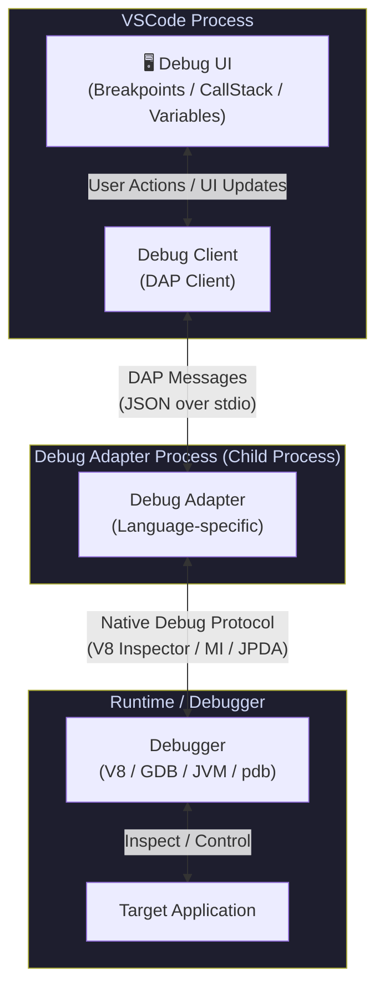
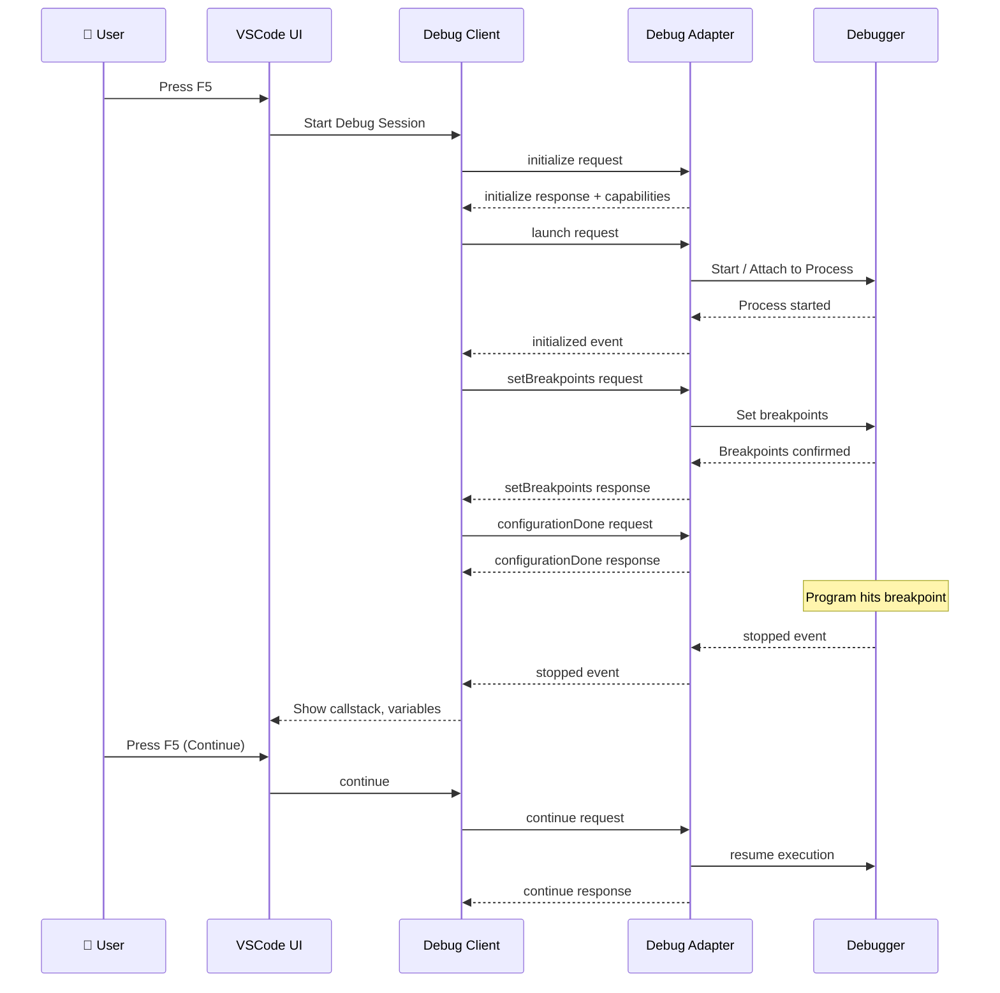
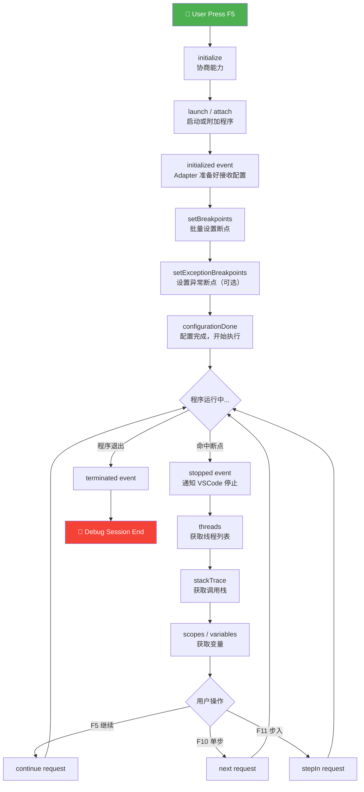
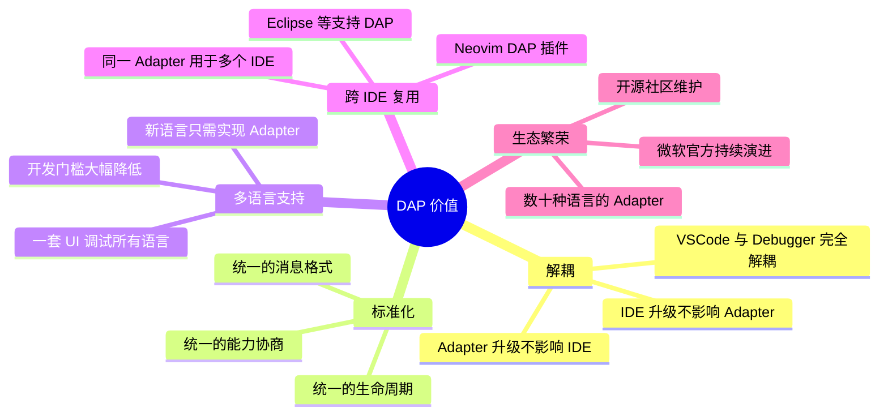

# VS Code Debug Adapter Protocol (DAP) 深度解析与实战

> 作者：资深 VSCode Extension 开发工程师  
> 适合读者：具有 Node.js / VSCode Extension 开发经验的工程师  
> 阅读时间：约 30 分钟

---

## 目录

1. [什么是 Debug Adapter Protocol](#1-什么是-debug-adapter-protocol)
2. [VSCode Debug 架构解析](#2-vscode-debug-架构解析)
3. [DAP 协议基础](#3-dap-协议基础)
4. [VSCode Debug 生命周期](#4-vscode-debug-生命周期)
5. [实战：实现一个最简单的 Debug Adapter](#5-实战实现一个最简单的-debug-adapter)
6. [Demo 项目结构](#6-demo-项目结构)
7. [Debug Adapter 核心代码实现](#7-debug-adapter-核心代码实现)
8. [VSCode Extension 如何启动 Debug Adapter](#8-vscode-extension-如何启动-debug-adapter)
9. [launch.json 示例](#9-launchjson-示例)
10. [运行 Demo](#10-运行-demo)
11. [进阶能力](#11-进阶能力)
12. [常见 Debug Adapter](#12-常见-debug-adapter)
13. [总结](#13-总结)
14. [参考资料](#参考资料)

---

## 1. 什么是 Debug Adapter Protocol

### VSCode 为什么要设计 DAP

在 VSCode 出现之前，每款 IDE 都需要为每种语言单独实现调试支持。这意味着：

- Eclipse 要为 Java 写一套调试集成
- IntelliJ 要为 Kotlin 写一套调试集成
- Sublime Text 没有原生调试，依赖插件生态各自为战

当 VSCode 团队决定打造一款支持多语言的编辑器时，他们面临一个核心问题：**如何让一个编辑器优雅地支持几十种语言的调试？**

暴力方案是：为每种语言写一个原生插件，直接对接语言运行时（Node.js、Python VM、JVM、GDB 等）。但这会导致：

- **代码爆炸**：每个插件都要重复实现 UI 交互、断点管理、变量展示等逻辑
- **维护噩梦**：VSCode 内核一旦修改调试 UI，所有插件都要跟着改
- **扩展门槛高**：开发者必须深入了解 VSCode 内部架构才能写调试插件

### DAP 解决什么问题

**Debug Adapter Protocol（DAP）** 于 2016 年由微软提出，随 VSCode 一同发布。它的核心价值是：

> 将"调试器 UI"与"语言调试实现"彻底解耦，通过标准化的 JSON 协议通信。

DAP 解决了以下问题：

| 问题 | DAP 解决方案 |
|------|-------------|
| 每种语言需要独立的调试 UI | 统一的 Debug UI，所有语言复用 |
| 调试器与 IDE 强耦合 | 通过标准协议通信，完全解耦 |
| 扩展开发门槛高 | 只需实现标准接口，无需了解 VSCode 内部 |
| 跨 IDE 移植困难 | 同一个 Debug Adapter 可用于多个 IDE |

### DAP 的核心思想

DAP 的设计哲学非常优雅，核心思想可以用一句话概括：

> **定义一套与语言无关、与 IDE 无关的调试通信标准。**

具体来说：

1. **协议层（Protocol）**：定义所有调试行为的消息格式（Request/Response/Event）
2. **适配层（Adapter）**：每种语言实现自己的 Debug Adapter，负责将 DAP 消息翻译为底层调试器指令
3. **客户端层（Client）**：VSCode 作为 Debug Client，只需要实现一次 DAP 通信即可支持所有语言

### VSCode Debug Architecture 概览

```
┌─────────────────────────────────────────────────────────────┐
│                        VSCode                               │
│                                                             │
│  ┌───────────────┐         ┌────────────────────────────┐  │
│  │   Debug UI    │ ◄─────► │     Debug Client (DAP)     │  │
│  │ (Breakpoints, │         │  (speaks Debug Adapter     │  │
│  │  Call Stack,  │         │        Protocol)           │  │
│  │  Variables)   │         └──────────────┬─────────────┘  │
│  └───────────────┘                        │                 │
└──────────────────────────────────────────┼─────────────────┘
                                           │ JSON over stdio/socket
                              ┌────────────▼────────────┐
                              │     Debug Adapter        │
                              │  (Language-specific,     │
                              │   e.g. node-debug2,      │
                              │   debugpy, delve)        │
                              └────────────┬─────────────┘
                                           │ Native Protocol
                                ┌──────────▼──────────┐
                                │      Debugger        │
                                │  (V8 Inspector,      │
                                │   GDB, JVM JPDA...)  │
                                └─────────────────────┘
```

---

## 2. VSCode Debug 架构解析

### 四大核心组件

**① VSCode（Debug UI）**
- 负责渲染断点、调用栈、变量、Watch 表达式等 UI
- 用户操作（点击行号设置断点、点击 F5 启动调试）均由此层发起
- 内部通过 `DebugService` 管理调试状态

**② Debug Client**
- VSCode 内置，实现了完整的 DAP 客户端
- 将用户操作转换为 DAP Request 消息发送给 Adapter
- 接收 Adapter 返回的 Response 和 Event，驱动 UI 更新

**③ Debug Adapter**
- 由插件开发者实现（或使用现成的，如 `node-debug2`）
- 运行在独立进程中，通过 stdio 或 socket 与 VSCode 通信
- 将 DAP 消息翻译为特定语言/运行时的调试指令

**④ Debugger（底层调试器）**
- 真正的调试实现（如 V8 Inspector Protocol、GDB、Python pdb）
- Debug Adapter 与其通信，获取真实的运行时状态

### 架构流程图（Mermaid）



### 通信流程详解



---

## 3. DAP 协议基础

DAP 消息基于 JSON，通过 HTTP-like 的头部分隔消息体，格式如下：

```
Content-Length: <字节数>\r\n
\r\n
<JSON Body>
```

### 三种消息类型

#### ① Request（客户端 → Adapter）

```typescript
interface Request {
  seq: number;        // 消息序列号，单调递增
  type: "request";
  command: string;    // 命令名，如 "initialize", "launch", "setBreakpoints"
  arguments?: any;    // 命令参数
}
```

#### ② Response（Adapter → 客户端）

```typescript
interface Response {
  seq: number;
  type: "response";
  request_seq: number;  // 对应的 Request seq
  success: boolean;     // 是否成功
  command: string;      // 对应的命令名
  message?: string;     // 错误信息（失败时）
  body?: any;           // 返回数据
}
```

#### ③ Event（Adapter → 客户端，主动推送）

```typescript
interface Event {
  seq: number;
  type: "event";
  event: string;   // 事件名，如 "initialized", "stopped", "output"
  body?: any;      // 事件数据
}
```

---

### 关键消息 JSON 示例

#### initialize Request

```json
{
  "seq": 1,
  "type": "request",
  "command": "initialize",
  "arguments": {
    "clientID": "vscode",
    "clientName": "Visual Studio Code",
    "adapterID": "my-debugger",
    "locale": "en",
    "linesStartAt1": true,
    "columnsStartAt1": true,
    "pathFormat": "path",
    "supportsVariableType": true,
    "supportsRunInTerminalRequest": true,
    "supportsMemoryReferences": true
  }
}
```

#### initialize Response

```json
{
  "seq": 1,
  "type": "response",
  "request_seq": 1,
  "success": true,
  "command": "initialize",
  "body": {
    "supportsConfigurationDoneRequest": true,
    "supportsFunctionBreakpoints": false,
    "supportsConditionalBreakpoints": true,
    "supportsEvaluateForHovers": true,
    "supportsStepBack": false,
    "supportsSetVariable": true,
    "supportsRestartFrame": false,
    "supportsGotoTargetsRequest": false,
    "supportsCompletionsRequest": false,
    "supportsModulesRequest": false
  }
}
```

#### launch Request

```json
{
  "seq": 2,
  "type": "request",
  "command": "launch",
  "arguments": {
    "noDebug": false,
    "program": "/workspace/demo/app.js",
    "stopOnEntry": true,
    "args": [],
    "cwd": "/workspace/demo",
    "runtimeExecutable": null,
    "env": {}
  }
}
```

#### setBreakpoints Request

```json
{
  "seq": 3,
  "type": "request",
  "command": "setBreakpoints",
  "arguments": {
    "source": {
      "name": "app.js",
      "path": "/workspace/demo/app.js"
    },
    "breakpoints": [
      { "line": 10 },
      { "line": 25, "condition": "i > 5" }
    ],
    "lines": [10, 25]
  }
}
```

#### setBreakpoints Response

```json
{
  "seq": 3,
  "type": "response",
  "request_seq": 3,
  "success": true,
  "command": "setBreakpoints",
  "body": {
    "breakpoints": [
      { "id": 1, "verified": true, "line": 10 },
      { "id": 2, "verified": true, "line": 25 }
    ]
  }
}
```

#### stopped Event（断点命中）

```json
{
  "seq": 10,
  "type": "event",
  "event": "stopped",
  "body": {
    "reason": "breakpoint",
    "description": "Paused on breakpoint",
    "threadId": 1,
    "allThreadsStopped": true,
    "hitBreakpointIds": [1]
  }
}
```

#### stackTrace Request & Response

```json
// Request
{
  "seq": 11,
  "type": "request",
  "command": "stackTrace",
  "arguments": {
    "threadId": 1,
    "startFrame": 0,
    "levels": 20
  }
}

// Response
{
  "seq": 11,
  "type": "response",
  "request_seq": 11,
  "success": true,
  "command": "stackTrace",
  "body": {
    "stackFrames": [
      {
        "id": 1,
        "name": "doSomething",
        "source": {
          "name": "app.js",
          "path": "/workspace/demo/app.js"
        },
        "line": 10,
        "column": 4
      },
      {
        "id": 2,
        "name": "main",
        "source": {
          "name": "app.js",
          "path": "/workspace/demo/app.js"
        },
        "line": 35,
        "column": 2
      }
    ],
    "totalFrames": 2
  }
}
```

---

## 4. VSCode Debug 生命周期

完整的调试生命周期按顺序分为以下阶段：



### 各阶段详解

**① initialize**
- 目的：客户端与 Adapter 协商能力（Capabilities）
- Adapter 告知 VSCode 它支持哪些特性：条件断点、hover 求值、变量修改等
- 这一步决定了 VSCode UI 会显示哪些调试功能按钮

**② launch / attach**
- `launch`：Adapter 负责启动目标程序
- `attach`：Adapter 附加到已运行的程序（如 `--inspect` 模式的 Node.js）
- 参数来自 `launch.json`

**③ initialized event**
- Adapter 发出此事件，告知 VSCode："我已启动，你可以发送断点配置了"
- VSCode 收到后，开始批量发送 `setBreakpoints`

**④ setBreakpoints**
- VSCode 将用户设置的所有断点一次性发送给 Adapter
- Adapter 返回每个断点的验证状态（`verified: true/false`）
- 未验证的断点在 UI 中显示为空心圆

**⑤ configurationDone**
- 所有配置（断点、异常断点等）发送完毕
- Adapter 收到后，正式让程序开始执行
- 这是"配置阶段"与"运行阶段"的分界线

**⑥ threads / stackTrace / scopes / variables**
- 程序停止后（断点或异常），VSCode 依次请求：
  - `threads`：获取所有线程
  - `stackTrace`：获取指定线程的调用栈
  - `scopes`：获取栈帧的作用域（Local / Global / Closure）
  - `variables`：获取作用域内的变量列表

**⑦ continue / next / stepIn / stepOut**
- 控制程序执行流：
  - `continue`：继续运行直到下一个断点
  - `next`：单步执行（Step Over），不进入函数
  - `stepIn`：步入（Step Into），进入函数调用
  - `stepOut`：步出（Step Out），从当前函数返回

---

## 5. 实战：实现一个最简单的 Debug Adapter

### 目标

实现一个 **Fake Debugger**，用 Node.js 写一个最简单的 Debug Adapter，模拟调试一个"虚拟程序"。功能包括：
- `launch`：启动虚拟程序
- `setBreakpoints`：记录断点
- `stackTrace`：返回虚拟调用栈
- `continue`：继续执行

### 初始化项目

```bash
mkdir demo-dap && cd demo-dap
npm init -y
npm install --save-dev typescript @types/node ts-node
npm install @vscode/debugadapter @vscode/debugprotocol
```

### tsconfig.json

```json
{
  "compilerOptions": {
    "target": "ES2018",
    "module": "commonjs",
    "lib": ["ES2018"],
    "outDir": "./out",
    "rootDir": "./src",
    "strict": false,
    "esModuleInterop": true,
    "skipLibCheck": true,
    "sourceMap": true
  },
  "include": ["src/**/*"],
  "exclude": ["node_modules", "out"]
}
```

### package.json（关键部分）

```json
{
  "name": "demo-dap",
  "version": "0.0.1",
  "scripts": {
    "compile": "tsc -p ./",
    "watch": "tsc -watch -p ./",
    "build-adapter": "tsc -p ./"
  },
  "engines": {
    "vscode": "^1.80.0"
  },
  "dependencies": {
    "@vscode/debugadapter": "^1.61.0",
    "@vscode/debugprotocol": "^1.61.0"
  },
  "devDependencies": {
    "@types/node": "^18.0.0",
    "@types/vscode": "^1.80.0",
    "typescript": "^5.0.0"
  }
}
```

---

## 6. Demo 项目结构

```
demo-dap/
├── package.json               # 项目配置 & 依赖
├── tsconfig.json              # TypeScript 编译配置
├── extension.ts               # VSCode Extension 入口，注册 Debug Adapter
├── src/
│   ├── debugAdapter.ts        # Debug Adapter 核心实现（DebugSession 子类）
│   └── simpleRuntime.ts       # 模拟运行时（Fake Debugger 核心逻辑）
├── out/                       # 编译输出目录
│   ├── debugAdapter.js
│   └── simpleRuntime.js
└── .vscode/
    └── launch.json            # Extension 调试配置 & Demo 调试配置
```

### 各文件职责

| 文件 | 职责 |
|------|------|
| `extension.ts` | VSCode Extension 主入口，注册 `DebugAdapterDescriptorFactory`，告知 VSCode 如何启动我们的 Adapter |
| `src/debugAdapter.ts` | 继承 `DebugSession`，处理所有 DAP 请求（launch/setBreakpoints/stackTrace 等） |
| `src/simpleRuntime.ts` | 模拟程序运行时，维护虚拟断点状态、调用栈、变量 |
| `.vscode/launch.json` | 定义如何启动调试（使用我们自定义的 `type: "demo-debug"`） |

---

## 7. Debug Adapter 核心代码实现

### src/simpleRuntime.ts — 模拟运行时

```typescript
import { EventEmitter } from "events";

export interface IRuntimeBreakpoint {
  id: number;
  line: number;
  verified: boolean;
}

export interface IRuntimeStackFrame {
  index: number;
  name: string;
  file: string;
  line: number;
}

/**
 * SimpleRuntime 模拟一个虚拟程序的运行时
 * 在真实场景中，这里会对接真正的调试器（如 V8 Inspector）
 */
export class SimpleRuntime extends EventEmitter {
  private _sourceFile: string = "";
  private _breakpoints = new Map<string, IRuntimeBreakpoint[]>();
  private _breakpointId = 1;
  private _currentLine = 1;

  // 模拟源文件内容（假设调试的文件有 50 行）
  private _totalLines = 50;

  constructor() {
    super();
  }

  /**
   * 启动虚拟程序
   * @param program 目标文件路径
   * @param stopOnEntry 是否在入口处暂停
   */
  public start(program: string, stopOnEntry: boolean): void {
    this._sourceFile = program;
    this._currentLine = 1;

    if (stopOnEntry) {
      // 立即触发 stopOnEntry 事件
      this.emit("stopOnEntry");
    } else {
      // 否则模拟程序运行到第一个断点
      this.run();
    }
  }

  /**
   * 模拟程序运行，遇到断点时暂停
   */
  public run(): void {
    // 模拟逐行"执行"，查找下一个断点
    for (let line = this._currentLine + 1; line <= this._totalLines; line++) {
      if (this.fireEventsForLine(line)) {
        this._currentLine = line;
        return;
      }
    }
    // 没有更多断点，程序正常结束
    this.emit("end");
  }

  /**
   * 单步执行
   */
  public step(): void {
    this._currentLine++;
    if (this._currentLine > this._totalLines) {
      this.emit("end");
    } else {
      this.emit("stopOnStep");
    }
  }

  /**
   * 检查指定行是否有断点，若有则触发 stopped 事件
   */
  private fireEventsForLine(line: number): boolean {
    const bps = this._breakpoints.get(this._sourceFile);
    if (bps) {
      const bp = bps.find((bp) => bp.line === line);
      if (bp) {
        this.emit("stopOnBreakpoint");
        return true;
      }
    }
    return false;
  }

  /**
   * 设置断点
   */
  public setBreakpoint(path: string, line: number): IRuntimeBreakpoint {
    const bp: IRuntimeBreakpoint = {
      id: this._breakpointId++,
      line,
      verified: false,
    };

    let bps = this._breakpoints.get(path);
    if (!bps) {
      bps = [];
      this._breakpoints.set(path, bps);
    }
    bps.push(bp);

    // 模拟验证断点（真实场景中需要等程序加载）
    bp.verified = true;
    this.emit("breakpointValidated", bp);

    return bp;
  }

  /**
   * 清除指定文件的所有断点
   */
  public clearBreakpoints(path: string): void {
    this._breakpoints.delete(path);
  }

  /**
   * 获取当前调用栈（模拟数据）
   */
  public stack(): IRuntimeStackFrame[] {
    return [
      {
        index: 0,
        name: "doSomething",
        file: this._sourceFile,
        line: this._currentLine,
      },
      {
        index: 1,
        name: "main",
        file: this._sourceFile,
        line: Math.max(1, this._currentLine - 5),
      },
    ];
  }

  public get currentLine(): number {
    return this._currentLine;
  }
}
```

### src/debugAdapter.ts — Debug Adapter 核心

```typescript
import {
  logger,
  Logger,
  LoggingDebugSession,
  InitializedEvent,
  TerminatedEvent,
  StoppedEvent,
  BreakpointEvent,
  OutputEvent,
  Thread,
  StackFrame,
  Scope,
  Source,
  Handles,
  Breakpoint,
  Variable,
} from "@vscode/debugadapter";
import { DebugProtocol } from "@vscode/debugprotocol";
import { SimpleRuntime, IRuntimeBreakpoint } from "./simpleRuntime";
import * as path from "path";

/**
 * launch.json 中 arguments 的类型定义
 */
interface ILaunchRequestArguments extends DebugProtocol.LaunchRequestArguments {
  program: string;       // 要调试的文件路径
  stopOnEntry?: boolean; // 是否在入口暂停
  trace?: boolean;       // 是否启用日志
}

/**
 * DemoDebugSession 继承自 LoggingDebugSession
 * LoggingDebugSession 继承自 DebugSession，并增加了日志功能
 *
 * 所有 DAP 请求都通过 xxxRequest 方法处理
 */
export class DemoDebugSession extends LoggingDebugSession {
  // 唯一的线程 ID（我们的 Fake Debugger 是单线程的）
  private static readonly THREAD_ID = 1;

  // 模拟运行时
  private _runtime: SimpleRuntime;

  // 变量句柄（用于管理 variablesReference，避免直接暴露内存地址）
  private _variableHandles = new Handles<string>();

  public constructor() {
    super("demo-dap.txt"); // 日志文件名

    // 行号和列号从 1 开始（与 VSCode UI 一致）
    this.setDebuggerLinesStartAt1(true);
    this.setDebuggerColumnsStartAt1(true);

    this._runtime = new SimpleRuntime();

    // 监听运行时事件，将其转换为 DAP Event 发送给 VSCode
    this._runtime.on("stopOnEntry", () => {
      this.sendEvent(new StoppedEvent("entry", DemoDebugSession.THREAD_ID));
    });

    this._runtime.on("stopOnStep", () => {
      this.sendEvent(new StoppedEvent("step", DemoDebugSession.THREAD_ID));
    });

    this._runtime.on("stopOnBreakpoint", () => {
      this.sendEvent(
        new StoppedEvent("breakpoint", DemoDebugSession.THREAD_ID)
      );
    });

    this._runtime.on("breakpointValidated", (bp: IRuntimeBreakpoint) => {
      // 通知 VSCode 断点已验证（实心圆 → 验证成功）
      this.sendEvent(
        new BreakpointEvent("changed", {
          verified: bp.verified,
          id: bp.id,
        } as DebugProtocol.Breakpoint)
      );
    });

    this._runtime.on("output", (text: string, filePath: string, line: number) => {
      const e: DebugProtocol.OutputEvent = new OutputEvent(`${text}\n`);
      e.body.source = this.createSource(filePath);
      e.body.line = this.convertDebuggerLineToClient(line);
      this.sendEvent(e);
    });

    this._runtime.on("end", () => {
      this.sendEvent(new TerminatedEvent());
    });
  }

  /**
   * ① initializeRequest
   * 协商 Adapter 的能力，告诉 VSCode 支持哪些功能
   */
  protected initializeRequest(
    response: DebugProtocol.InitializeResponse,
    args: DebugProtocol.InitializeRequestArguments
  ): void {
    response.body = response.body || {};

    // 声明支持的能力
    response.body.supportsConfigurationDoneRequest = true; // 支持 configurationDone
    response.body.supportsEvaluateForHovers = false;        // 不支持 hover 求值
    response.body.supportsStepBackRequest = false;           // 不支持步退
    response.body.supportsConditionalBreakpoints = false;    // 不支持条件断点
    response.body.supportsCancelRequest = false;
    response.body.supportsBreakpointLocationsRequest = false;

    this.sendResponse(response);

    // 发送 initialized 事件，通知 VSCode 可以发送断点配置了
    this.sendEvent(new InitializedEvent());
  }

  /**
   * ② launchRequest
   * 启动被调试的程序
   */
  protected launchRequest(
    response: DebugProtocol.LaunchResponse,
    args: ILaunchRequestArguments
  ): void {
    // 配置日志级别
    logger.setup(
      args.trace ? Logger.LogLevel.Verbose : Logger.LogLevel.Stop,
      false
    );

    // 通知 VSCode 程序已启动，输出一条信息
    this.sendEvent(
      new OutputEvent(`Launching program: ${args.program}\n`, "console")
    );

    // 启动模拟运行时
    this._runtime.start(args.program, !!args.stopOnEntry);

    this.sendResponse(response);
  }

  /**
   * ③ setBreakPointsRequest
   * VSCode 发送所有断点，Adapter 需要验证并记录
   */
  protected setBreakPointsRequest(
    response: DebugProtocol.SetBreakpointsResponse,
    args: DebugProtocol.SetBreakpointsArguments
  ): void {
    const clientLines = args.breakpoints
      ? args.breakpoints.map((bp) => bp.line)
      : [];
    const path = args.source.path as string;

    // 先清除该文件的旧断点
    this._runtime.clearBreakpoints(path);

    // 重新设置新断点
    const actualBreakpoints: DebugProtocol.Breakpoint[] = clientLines.map(
      (line) => {
        const runtimeBp = this._runtime.setBreakpoint(
          path,
          this.convertClientLineToDebugger(line)
        );
        // 创建 DAP Breakpoint 对象返回给 VSCode
        const bp = new Breakpoint(
          runtimeBp.verified,
          this.convertDebuggerLineToClient(runtimeBp.line)
        ) as DebugProtocol.Breakpoint;
        bp.id = runtimeBp.id;
        return bp;
      }
    );

    response.body = {
      breakpoints: actualBreakpoints,
    };
    this.sendResponse(response);
  }

  /**
   * configurationDoneRequest
   * 所有断点配置完成，可以开始执行程序
   */
  protected configurationDoneRequest(
    response: DebugProtocol.ConfigurationDoneResponse,
    args: DebugProtocol.ConfigurationDoneArguments
  ): void {
    super.configurationDoneRequest(response, args);
    // 如果不是 stopOnEntry，在配置完成后继续运行
  }

  /**
   * ④ threadsRequest
   * VSCode 停下后会请求线程列表
   */
  protected threadsRequest(response: DebugProtocol.ThreadsResponse): void {
    // 我们只有一个主线程
    response.body = {
      threads: [new Thread(DemoDebugSession.THREAD_ID, "Main Thread")],
    };
    this.sendResponse(response);
  }

  /**
   * ⑤ stackTraceRequest
   * 获取指定线程的调用栈
   */
  protected stackTraceRequest(
    response: DebugProtocol.StackTraceResponse,
    args: DebugProtocol.StackTraceArguments
  ): void {
    const startFrame = typeof args.startFrame === "number" ? args.startFrame : 0;
    const maxLevels = typeof args.levels === "number" ? args.levels : 20;

    const runtimeStack = this._runtime.stack();

    // 将运行时栈帧转换为 DAP StackFrame
    const frames: DebugProtocol.StackFrame[] = runtimeStack
      .slice(startFrame, startFrame + maxLevels)
      .map((frame) => {
        return new StackFrame(
          frame.index,
          frame.name,
          this.createSource(frame.file),
          this.convertDebuggerLineToClient(frame.line)
        );
      });

    response.body = {
      stackFrames: frames,
      totalFrames: runtimeStack.length,
    };
    this.sendResponse(response);
  }

  /**
   * scopesRequest
   * 获取栈帧的作用域列表
   */
  protected scopesRequest(
    response: DebugProtocol.ScopesResponse,
    args: DebugProtocol.ScopesArguments
  ): void {
    response.body = {
      scopes: [
        new Scope(
          "Local",
          this._variableHandles.create("local_" + args.frameId),
          false
        ),
        new Scope(
          "Global",
          this._variableHandles.create("global_" + args.frameId),
          true
        ),
      ],
    };
    this.sendResponse(response);
  }

  /**
   * variablesRequest
   * 获取作用域内的变量列表
   */
  protected variablesRequest(
    response: DebugProtocol.VariablesResponse,
    args: DebugProtocol.VariablesArguments
  ): void {
    const id = this._variableHandles.get(args.variablesReference);

    // 返回模拟变量
    const variables: DebugProtocol.Variable[] = [];
    if (id && id.startsWith("local_")) {
      variables.push(
        {
          name: "count",
          type: "number",
          value: "42",
          variablesReference: 0,
        },
        {
          name: "message",
          type: "string",
          value: '"Hello, DAP!"',
          variablesReference: 0,
        },
        {
          name: "isRunning",
          type: "boolean",
          value: "true",
          variablesReference: 0,
        }
      );
    }

    response.body = { variables };
    this.sendResponse(response);
  }

  /**
   * ⑥ continueRequest
   * 继续执行程序
   */
  protected continueRequest(
    response: DebugProtocol.ContinueResponse,
    args: DebugProtocol.ContinueArguments
  ): void {
    response.body = { allThreadsContinued: true };
    this.sendResponse(response);

    // 让运行时继续运行
    this._runtime.run();
  }

  /**
   * nextRequest (Step Over)
   */
  protected nextRequest(
    response: DebugProtocol.NextResponse,
    args: DebugProtocol.NextArguments
  ): void {
    this.sendResponse(response);
    this._runtime.step();
  }

  /**
   * 辅助方法：创建 DAP Source 对象
   */
  private createSource(filePath: string): Source {
    return new Source(
      path.basename(filePath),
      this.convertDebuggerPathToClient(filePath)
    );
  }
}

// 以 stdin/stdout 模式启动 Debug Adapter
DemoDebugSession.run(DemoDebugSession);
```

---

## 8. VSCode Extension 如何启动 Debug Adapter

### extension.ts — Extension 主入口

```typescript
import * as vscode from "vscode";
import * as path from "path";
import * as Net from "net";
import { DemoDebugSession } from "./src/debugAdapter";

/**
 * Extension 激活入口
 */
export function activate(context: vscode.ExtensionContext) {
  console.log("Demo DAP Extension is now active!");

  // 方式一：内联模式（In-process）
  // Debug Adapter 直接运行在 Extension Host 进程中，无需额外进程
  // 适合开发调试阶段，性能最优但不隔离
  const inlineFactory = new InlineDebugAdapterFactory();
  context.subscriptions.push(
    vscode.debug.registerDebugAdapterDescriptorFactory(
      "demo-debug",  // 与 package.json contributes.debuggers.type 一致
      inlineFactory
    )
  );

  // 方式二：注册一个启动调试的命令（可选）
  context.subscriptions.push(
    vscode.commands.registerCommand("demo-debug.startDebug", () => {
      vscode.debug.startDebugging(undefined, {
        type: "demo-debug",
        name: "Demo Debug",
        request: "launch",
        program: "${file}",
        stopOnEntry: true,
      });
    })
  );
}

export function deactivate() {}

/**
 * InlineDebugAdapterFactory
 * 以内联模式运行 Debug Adapter（在 Extension Host 进程内）
 * 优点：无需启动子进程，调试 Adapter 本身更方便
 */
class InlineDebugAdapterFactory
  implements vscode.DebugAdapterDescriptorFactory
{
  createDebugAdapterDescriptor(
    _session: vscode.DebugSession
  ): vscode.ProviderResult<vscode.DebugAdapterDescriptor> {
    // 直接实例化 DebugSession，VSCode 通过接口调用
    return new vscode.DebugAdapterInlineImplementation(new DemoDebugSession());
  }
}

/**
 * ExecutableDebugAdapterFactory
 * 以独立进程模式运行 Debug Adapter
 * 优点：进程隔离，Adapter 崩溃不影响 Extension Host
 * 适合生产环境
 */
class ExecutableDebugAdapterFactory
  implements vscode.DebugAdapterDescriptorFactory
{
  private _context: vscode.ExtensionContext;

  constructor(context: vscode.ExtensionContext) {
    this._context = context;
  }

  createDebugAdapterDescriptor(
    _session: vscode.DebugSession
  ): vscode.ProviderResult<vscode.DebugAdapterDescriptor> {
    // 指定 Adapter 的可执行文件路径
    const adapterPath = this._context.asAbsolutePath(
      path.join("out", "debugAdapter.js")
    );

    return new vscode.DebugAdapterExecutable("node", [adapterPath], {
      cwd: this._context.extensionPath,
      env: {
        DEBUG_ADAPTER_LOG: "1",
      },
    });
  }
}

/**
 * ServerDebugAdapterFactory
 * 以 Socket 服务器模式运行 Debug Adapter
 * 适合需要复用 Adapter 进程，或远程调试场景
 */
class ServerDebugAdapterFactory
  implements vscode.DebugAdapterDescriptorFactory
{
  private _server?: Net.Server;

  createDebugAdapterDescriptor(
    session: vscode.DebugSession,
    executable: vscode.DebugAdapterExecutable | undefined
  ): vscode.ProviderResult<vscode.DebugAdapterDescriptor> {
    if (!this._server) {
      this._server = Net.createServer((socket) => {
        const session = new DemoDebugSession();
        session.setRunAsServer(true);
        session.start(socket as any, socket);
      }).listen(0); // 随机端口
    }

    const address = this._server.address() as Net.AddressInfo;
    return new vscode.DebugAdapterServer(address.port);
  }

  dispose() {
    if (this._server) {
      this._server.close();
    }
  }
}
```

### package.json contributes（Extension Manifest 关键部分）

```json
{
  "contributes": {
    "debuggers": [
      {
        "type": "demo-debug",
        "label": "Demo Debugger",
        "program": "./out/debugAdapter.js",
        "runtime": "node",
        "configurationAttributes": {
          "launch": {
            "required": ["program"],
            "properties": {
              "program": {
                "type": "string",
                "description": "Absolute path to the program to debug.",
                "default": "${workspaceFolder}/app.js"
              },
              "stopOnEntry": {
                "type": "boolean",
                "description": "Automatically stop after launch.",
                "default": true
              },
              "trace": {
                "type": "boolean",
                "description": "Enable logging of the Debug Adapter Protocol.",
                "default": false
              }
            }
          }
        },
        "initialConfigurations": [
          {
            "type": "demo-debug",
            "request": "launch",
            "name": "Debug with Demo Debugger",
            "program": "${workspaceFolder}/app.js",
            "stopOnEntry": true
          }
        ],
        "configurationSnippets": [
          {
            "label": "Demo Debug: Launch",
            "description": "A new configuration for debugging with Demo Debugger.",
            "body": {
              "type": "demo-debug",
              "request": "launch",
              "name": "${2:Launch Program}",
              "program": "^\"\\${workspaceFolder}/${1:app.js}\"",
              "stopOnEntry": true
            }
          }
        ]
      }
    ],
    "breakpoints": [
      {
        "language": "javascript"
      },
      {
        "language": "typescript"
      }
    ]
  }
}
```

---

## 9. launch.json 示例

### .vscode/launch.json（完整示例）

```json
{
  "version": "0.2.0",
  "configurations": [
    {
      // 用于开发调试 Extension 本身（Extension Host 模式）
      "name": "Run Extension",
      "type": "extensionHost",
      "request": "launch",
      "args": ["--extensionDevelopmentPath=${workspaceFolder}"],
      "outFiles": ["${workspaceFolder}/out/**/*.js"],
      "preLaunchTask": "${defaultBuildTask}"
    },
    {
      // 用于调试 Debug Adapter 本身
      "name": "Debug Adapter",
      "type": "node",
      "request": "launch",
      "program": "${workspaceFolder}/out/debugAdapter.js",
      "args": ["--server=4711"],
      "outFiles": ["${workspaceFolder}/out/**/*.js"]
    },
    {
      // 使用我们自定义的 Demo Debugger 调试一个 JS 文件
      "name": "Demo Debug Launch",
      "type": "demo-debug",
      "request": "launch",
      "program": "${workspaceFolder}/sample/app.js",
      "stopOnEntry": true,
      "trace": false
    },
    {
      // 附加模式示例（attach）
      "name": "Demo Debug Attach",
      "type": "demo-debug",
      "request": "attach",
      "port": 9229,
      "address": "localhost"
    }
  ],
  "compounds": [
    {
      // 同时启动 Extension 和 Debug Adapter 调试（Extension + Adapter 联调）
      "name": "Extension + Adapter",
      "configurations": ["Run Extension", "Debug Adapter"]
    }
  ]
}
```

---

## 10. 运行 Demo

### 完整运行步骤

#### Step 1：安装依赖

```bash
cd demo-dap
npm install
```

#### Step 2：编译 TypeScript

```bash
npm run compile
# 或者开启监听模式（推荐开发时使用）
npm run watch
```

#### Step 3：创建测试文件

```bash
mkdir -p sample
cat > sample/app.js << 'EOF'
// 这是我们要"调试"的目标文件
function greet(name) {
  const message = "Hello, " + name;
  console.log(message);
  return message;
}

function main() {
  const names = ["World", "DAP", "VSCode"];
  for (let i = 0; i < names.length; i++) {
    const result = greet(names[i]);
    console.log("Result:", result);
  }
}

main();
EOF
```

#### Step 4：在 VSCode 中按 F5 启动 Extension Host

打开 `.vscode/launch.json`，选择 `Run Extension` 配置，按 `F5`。

这会打开一个新的 **Extension Development Host** 窗口，其中已安装了我们的 Demo Extension。

#### Step 5：在 Extension Host 窗口中启动调试

1. 打开 `sample/app.js`
2. 在第 3 行点击行号左侧设置断点
3. 按 `F5` 或打开命令面板 → `Debug: Start Debugging`
4. 选择 `Demo Debug Launch` 配置

#### Step 6：观察调试效果

```
期望看到的效果：
✅ 程序在 stopOnEntry 处暂停（第 1 行）
✅ 左侧 Call Stack 面板显示：
   - doSomething (app.js:1)
   - main (app.js:1)
✅ Variables 面板显示：
   Local:
   - count: 42
   - message: "Hello, DAP!"
   - isRunning: true
✅ 按 F5 继续，程序运行到断点处再次暂停
✅ 按 F10 单步，程序逐行执行
✅ Debug Console 输出：Launching program: .../app.js
```

### 调试 Adapter 本身

当 Adapter 有 Bug 时，可以通过以下方式调试：

```bash
# 在 launch.json 中使用 "Debug Adapter" 配置
# Adapter 以 --server=4711 模式启动，VSCode 通过 socket 连接
# 可以在 debugAdapter.ts 中打断点
```

---

## 11. 进阶能力

### 变量查看（Variables）

变量查看需要实现 `scopesRequest` 和 `variablesRequest`，关键在于 `variablesReference`：
- `variablesReference = 0`：叶节点，不可展开
- `variablesReference > 0`：可展开的对象/数组，需要再次调用 `variablesRequest`

```typescript
// 返回一个对象类型的变量（可展开）
const objHandle = this._variableHandles.create("obj_data");
variables.push({
  name: "user",
  type: "object",
  value: "Object",
  variablesReference: objHandle, // 非零 = 可展开
});

// 当 VSCode 展开 user 时，会再次请求 variablesReference = objHandle 的变量
// 此时返回 user 的属性
```

### 多线程支持

多线程调试需要：
1. `threadsRequest` 返回多个 `Thread` 对象
2. `stopped` 事件指定 `threadId`
3. `stackTraceRequest` 按 `threadId` 返回对应调用栈

```typescript
protected threadsRequest(response: DebugProtocol.ThreadsResponse): void {
  response.body = {
    threads: [
      new Thread(1, "Main Thread"),
      new Thread(2, "Worker Thread #1"),
      new Thread(3, "Worker Thread #2"),
    ],
  };
  this.sendResponse(response);
}
```

### 条件断点

在 `initializeRequest` 中声明 `supportsConditionalBreakpoints: true`，然后在 `setBreakPointsRequest` 中处理 `condition` 字段：

```typescript
protected setBreakPointsRequest(
  response: DebugProtocol.SetBreakpointsResponse,
  args: DebugProtocol.SetBreakpointsArguments
): void {
  const breakpoints = args.breakpoints || [];
  
  const actualBreakpoints = breakpoints.map((bp) => {
    const condition = bp.condition; // "i > 5" 这样的条件表达式
    const hitCondition = bp.hitCondition; // "3" 表示命中 3 次后才暂停
    
    // 将条件传递给运行时，由运行时在命中断点时求值
    const runtimeBp = this._runtime.setBreakpoint(
      args.source.path!,
      bp.line,
      condition,
      hitCondition
    );
    
    return new Breakpoint(runtimeBp.verified, bp.line);
  });
  
  response.body = { breakpoints: actualBreakpoints };
  this.sendResponse(response);
}
```

### Step Into / Step Over / Step Out

```typescript
// Step Over：执行下一行，不进入函数
protected nextRequest(
  response: DebugProtocol.NextResponse,
  args: DebugProtocol.NextArguments
): void {
  this.sendResponse(response);
  this._runtime.step(false); // false = 不进入函数
}

// Step Into：进入函数调用
protected stepInRequest(
  response: DebugProtocol.StepInResponse,
  args: DebugProtocol.StepInArguments
): void {
  this.sendResponse(response);
  this._runtime.step(true); // true = 进入函数
}

// Step Out：从当前函数返回
protected stepOutRequest(
  response: DebugProtocol.StepOutResponse,
  args: DebugProtocol.StepOutArguments
): void {
  this.sendResponse(response);
  this._runtime.stepOut();
}
```

### Evaluate（Hover 求值 & Watch 表达式）

```typescript
protected evaluateRequest(
  response: DebugProtocol.EvaluateResponse,
  args: DebugProtocol.EvaluateArguments
): void {
  // args.context: "hover" | "watch" | "repl"
  // args.expression: 要求值的表达式
  // args.frameId: 在哪个栈帧上下文中求值
  
  const result = this._runtime.evaluate(args.expression, args.frameId);
  
  response.body = {
    result: result.toString(),
    type: typeof result,
    variablesReference: 0,
  };
  this.sendResponse(response);
}
```

---

## 12. 常见 Debug Adapter

### Node.js Debug（node-debug2 / js-debug）

- **仓库**：[microsoft/vscode-js-debug](https://github.com/microsoft/vscode-js-debug)
- **底层协议**：V8 Inspector Protocol（基于 WebSocket + JSON）
- **特点**：支持 Source Maps、Smart Stepping、Worker Threads
- **Adapter 实现亮点**：
  ```
  VSCode DAP ──► js-debug Adapter ──► V8 Inspector (CDP)
                                      └──► Node.js / Chrome DevTools
  ```

### Python Debug（debugpy）

- **仓库**：[microsoft/debugpy](https://github.com/microsoft/debugpy)
- **底层**：Python 的 `settrace` API + 自定义通信协议
- **特点**：支持远程调试、Jupyter Notebook 调试、多线程 GIL 感知
- **启动方式**：
  ```bash
  python -m debugpy --listen 5678 --wait-for-client app.py
  ```

### Go Debug（delve / vscode-go）

- **仓库**：[go-delve/delve](https://github.com/go-delve/delve)
- **底层**：Delve 原生支持 DAP 协议（从 delve 1.6.0 开始）
- **特点**：支持 Goroutine 调试（多协程视图）、Core dump 分析
- **特色功能**：
  ```json
  // launch.json 中可以指定 goroutine 过滤
  {
    "type": "go",
    "request": "launch",
    "showGlobalVariables": true,
    "goroutineFilters": ["main.go"]
  }
  ```

### Java Debug（vscode-java-debug）

- **仓库**：[microsoft/vscode-java-debug](https://github.com/microsoft/vscode-java-debug)
- **底层**：JPDA（Java Platform Debugger Architecture）+ JDWP 协议
- **特点**：支持热代码替换（Hot Code Replace）、表达式求值、反编译查看
- **架构**：
  ```
  VSCode DAP ──► Java Debug Server (JDT LS) ──► JDWP ──► JVM
  ```

### 各 Adapter 对比

| Adapter | 语言 | 底层协议 | 远程调试 | 条件断点 | 表达式求值 |
|---------|------|---------|---------|---------|-----------|
| js-debug | JS/TS | V8 Inspector (CDP) | ✅ | ✅ | ✅ |
| debugpy | Python | pdb/settrace | ✅ | ✅ | ✅ |
| delve | Go | Delve DAP | ✅ | ✅ | ✅ |
| vscode-java-debug | Java | JPDA/JDWP | ✅ | ✅ | ✅ |
| CodeLLDB | C/C++/Rust | LLDB | ✅ | ✅ | ✅ |

---

## 13. 总结

### DAP 的核心价值



### 关键设计决策回顾

1. **进程隔离**：Debug Adapter 运行在独立进程，崩溃不影响 VSCode，通过 stdio/socket 通信保证稳定性。

2. **能力协商（Capabilities）**：`initialize` 阶段的能力声明机制，使得 Adapter 可以渐进式实现功能，VSCode UI 会根据声明的能力动态显示/隐藏按钮。

3. **事件驱动**：程序状态变化（断点命中、输出、线程创建）通过 Event 主动推送，而非轮询，保证了低延迟和高效率。

4. **统一行号/列号约定**：通过 `linesStartAt1` / `columnsStartAt1` 协商，解决了不同语言、运行时对行号定义不一致的问题。

### 与 LSP 的关系

DAP 与 Language Server Protocol（LSP）是孪生兄弟：

| 维度 | LSP | DAP |
|------|-----|-----|
| 解决问题 | 代码智能（补全/跳转/重构） | 调试（断点/变量/调用栈） |
| 提出时间 | 2016 | 2016 |
| 提出者 | Microsoft | Microsoft |
| 通信格式 | JSON-RPC | JSON（类 HTTP 头） |
| 进程模型 | Language Server 独立进程 | Debug Adapter 独立进程 |

两者共同构成了 VSCode 生态的基础设施，使得 VSCode 能够以极低的成本支持数百种编程语言的开发体验。

### 学习路径建议

```
初学者：
  阅读 DAP 官方规范 → 运行本文 Demo → 修改 SimpleRuntime 增加功能

进阶：
  阅读 vscode-mock-debug 源码 → 对接真实运行时（如 Node.js child_process）

高级：
  实现完整 Debug Adapter → 支持远程调试 → 发布到 VSCode Marketplace
```

---

## 参考资料

- [Debug Adapter Protocol 官方规范](https://microsoft.github.io/debug-adapter-protocol/)
- [VSCode Extension API - Debug](https://code.visualstudio.com/api/extension-guides/debugger-extension)
- [vscode-mock-debug（官方示例）](https://github.com/microsoft/vscode-mock-debug)
- [vscode-js-debug（Node.js Adapter 参考实现）](https://github.com/microsoft/vscode-js-debug)
- [debugpy（Python Debug Adapter）](https://github.com/microsoft/debugpy)
- [@vscode/debugadapter npm 包](https://www.npmjs.com/package/@vscode/debugadapter)
- [VSCode 官方文档 - Debugging](https://code.visualstudio.com/docs/editor/debugging)
- [DAP Overview - Microsoft 博客](https://microsoft.github.io/debug-adapter-protocol/overview)

---

> 本文代码均基于 `@vscode/debugadapter@1.61.0` 和 `VSCode 1.80+` 验证。如有疑问或发现错误，欢迎在评论区指出。
>
> **如果本文对你有帮助，欢迎点赞收藏！** 🎉