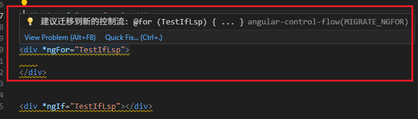
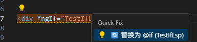
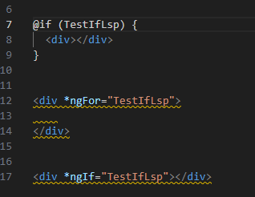

# Weekly Knowledge Share  
## Language Server Protocol (LSP)

---

### 1. 背景  
在代码开发过程中，编辑器或 IDE 会提供一些常见的“智能”功能，例如：  
- **语法高亮** (Syntax Highlighting)  
- **自动补全** (Autocomplete / IntelliSense)  
- **跳转定义** (Go to Definition)  
- **查找引用** (Find References)  
- **代码诊断** (Diagnostics, Errors & Warnings)  

早期，这些功能大多是编辑器自己实现的，导致：  
- **重复造轮子**：每个编辑器需要针对不同语言重复开发  
- **功能差异大**：不同 IDE 支持同一种语言时功能不一致  
- **维护成本高**：语言升级或语法变化时，需要多方适配  

**LSP (Language Server Protocol)** 正是为了解决这些痛点而诞生的。  

---

### 2. 什么是 LSP  
**Language Server Protocol (语言服务器协议)** 是 **微软** 在 2016 年提出的一种开放协议，核心思想是：  

👉 **把“语言智能”功能从编辑器里抽离出来，统一由独立的语言服务器提供。**  

- **编辑器 (Client)**：负责 UI 展示与用户交互  
- **语言服务器 (Server)**：负责分析代码，提供智能提示  
- **协议 (Protocol)**：客户端与服务端通过 JSON-RPC 通信  

这样，**一个语言服务器可以服务多个编辑器**，大大减少了重复开发。  

---

### 3. 工作原理  
LSP 的工作机制可以类比为 **前端调用后端 API**：  

1. **客户端 (Client)**：VS Code 
2. **服务器 (Server)**：针对某个语言的实现（如 TypeScript Language Server、Pyright、gopls）  
3. **协议 (Protocol)**：定义了固定的请求和响应格式（基于 JSON-RPC）  

常见交互流程：  
- Client → Server: `textDocument/completion` 请求代码补全  
- Server → Client: 返回候选补全项  
- Client → Server: `textDocument/definition` 请求跳转定义  
- Server → Client: 返回定义位置  


---

### 4. 应用场景  
- **代码补全**（智能提示）  
- **跳转定义 / 查找引用**  
- **悬停提示**（Hover Info）  
- **诊断信息**（编译错误、警告）  
- **代码格式化**（Format Document）  
- **重构功能**（Rename Symbol、Code Action）  


**TypeScript / JavaScript** → TypeScript Server  
 

<!-- 主流语言的 LSP 实现：  
- **Python** → Pyright, Pylance  
- **Go** → gopls  
- **Rust** → rust-analyzer  
- **Java** → Eclipse JDT LS   -->

---

### 5. 优势与局限  

**优势**  
- 🔹 **跨编辑器**：一次开发，处处使用  
- 🔹 **易扩展**：语言作者只需实现一个 Server  
- 🔹 **降低成本**：IDE 开发者不用重复实现语言解析  

---

### 6.开发一个符合自己需求的 LSP 

##### 1. 需求背景 
  - 在修改代码时，有时会复制到旧 control flow 写的代码，由于粗心会将这块漏过去
  - 开发一个 LSP 用于在 VS Code 中检查 Angular 模板文件，提醒开发者是否还有遗留的旧语法，并一键替换（只检查 Change 文件）
##### 2. 明确需求检查那几个 control flow
  - ngIf --> @if (...)
  - ngFor --> @for (...)
##### 3. 实现步骤
  1. 建立 VSCode 插件 + LSP 服务
     1. 插件部分只负责启动语言服务。
     2. 语言服务部分负责扫描 .html 文件，找出 *ngIf 和 *ngFor 并发出诊断信息。
  2. 核心逻辑
     1. 在 LSP 的 onDidChangeContent 事件里，读取文档内容。
     2. 利用正则截取对应的代码再拼接
     3. 读取文档
     4. 用 正则 找到有 *ngIf / *ngFor 的节点
     5. 构造 Quick Fix，把整个元素替换成 block 形式
     6. 返回 Diagnostic[]，VS Code 就会在文件中打黄线。
  3. 项目结构
      ```js
      angular-lsp/
        ├── src/   (VSCode 插件)
            ├── extension.ts/   (Client)
            ├── server/   (语言服务器)
              ├── server.ts/   (语言服务器)
        ├── package.json
      ```
  4. 代码 
    Server 
    ```js
    // 升级版的 Angular 模板分析函数
    function analyzeAngularTemplate(document: TextDocument) {
      const content = document.getText();
      const diagnostics: Diagnostic[] = [];
      
      debugLog("开始分析 Angular 模板");
      // 检测 *ngIf
      const ngIfRegex = /\*ngIf\s*=\s*"([^"]+)"/g;
      let match;
      
      while ((match = ngIfRegex.exec(content)) !== null) {
        const range = getElementRange(content, match);
        const condition = match[1];
        
        debugLog(`发现 *ngIf: ${match[0]} 在位置 ${match.index}`);
        
        // 生成新的控制流语法
        const elementContent = content.substring(
          content.indexOf('>', match.index) + 1,
          content.lastIndexOf('<', content.indexOf(`</${getTagName(content, match.index)}`, match.index))
        ).trim();
        
        const newControlFlow = `@if (${condition}) {\n  ${elementContent}\n}`;
        
        diagnostics.push({
          message: `💡 建议迁移到新的控制流: @if (${condition}) { ... }`,
          range,
          severity: DiagnosticSeverity.Warning,
          source: "angular-control-flow",
          code: "MIGRATE_NGIF",
          data: {
            condition,
            originalText: match[0],
            suggestedText: newControlFlow,
            elementRange: range,
            replacementText: newControlFlow
          }
        });
      }
      return diagnostics;
    }

    function createNgIfCodeAction(document: TextDocument, diagnostic: Diagnostic, data: any): CodeAction {
      const content = document.getText();
      const elementRange = data.elementRange;
      
      // 获取元素的完整内容
      const elementText = document.getText(elementRange);
      
      // 解析元素结构
      const tagMatch = elementText.match(/<(\w+)([^>]*?)(\*ngIf="[^"]+")([^>]*?)>(.*?)<\/\1>/s);
      if (!tagMatch) {
        // 处理自闭合标签或简单情况
        const simpleMatch = elementText.match(/<(\w+)([^>]*?)(\*ngIf="[^"]+")([^>]*?)\/?>/);
        if (simpleMatch) {
          const [, tagName, beforeAttr, ngIfAttr, afterAttr] = simpleMatch;
          const condition = ngIfAttr.match(/\*ngIf="([^"]+)"/)?.[1] || data.condition;
          const cleanAttrs = (beforeAttr + afterAttr).trim();
          const newElement = cleanAttrs ? `<${tagName} ${cleanAttrs} />` : `<${tagName} />`;
          const replacement = `@if (${condition}) {\n  ${newElement}\n}`;
          
          return {
            title: `🔄 替换为 @if (${condition})`,
            kind: CodeActionKind.QuickFix,
            diagnostics: [diagnostic],
            edit: {
              changes: {
                [document.uri]: [{
                  range: elementRange,
                  newText: replacement
                }]
              }
            }
          };
        }
      } else {
        const [, tagName, beforeAttr, ngIfAttr, afterAttr, innerContent] = tagMatch;
        const condition = data.condition;
        const cleanAttrs = (beforeAttr + afterAttr).trim();
        const newElement = cleanAttrs 
          ? `<${tagName} ${cleanAttrs}>${innerContent}</${tagName}>`
          : `<${tagName}>${innerContent}</${tagName}>`;
        
        const replacement = `@if (${condition}) {\n  ${newElement}\n}`;
        
        return {
          title: `🔄 替换为 @if (${condition})`,
          kind: CodeActionKind.QuickFix,
          diagnostics: [diagnostic],
          edit: {
            changes: {
              [document.uri]: [{
                range: elementRange,
                newText: replacement
              }]
            }
          }
        };
      }

      // 默认回退
      return {
        title: `🔄 替换为新的 @if 控制流`,
        kind: CodeActionKind.QuickFix,
        diagnostics: [diagnostic],
        edit: {
          changes: {
            [document.uri]: [{
              range: diagnostic.range,
              newText: `@if (${data.condition})`
            }]
          }
        }
      };
    }
    ```

    完整代码 https://github.com/Xiaohang0316/Blog/tree/master/LSP/angular-lsp
  5. 效果图 
展示下划线，提出建议

一键替换 旧 control flow 

替换效果



<!-- **局限**  
- ⚠️ **性能依赖语言服务器实现**（某些 server 启动慢 / 占用内存大）  
- ⚠️ **协议功能有限**，部分 IDE 的深度功能可能超出 LSP 能力  
- ⚠️ **生态差异**：不同语言的 LSP 实现质量差距较大   -->

---

<!-- ### 7. 总结  
- LSP 是一种 **解耦语言智能与编辑器的协议**  
- **核心思想**：语言功能由 Server 提供，编辑器只负责调用  
- **价值**：提升开发效率，减少重复开发，推动工具链标准化   -->


---

### 💡 延伸阅读  
- [Language Server Protocol 官网](https://microsoft.github.io/language-server-protocol/)  
- [VS Code LSP 实现示例](https://code.visualstudio.com/docs/extensions/example-language-server)  
