# Quarterly Coverage Review Agent — 诞生全过程与架构分享

> 作者：Clarify Platform QA Automation Team  
> 日期：2026-05-26  
> 适用项目：`clarify-platform-qa-automation`

---

## 目录

1. [背景与动机](#1-背景与动机)
2. [开发历程——真实对话记录](#2-开发历程真实对话记录)
3. [整体架构](#3-整体架构)
4. [核心文件职责](#4-核心文件职责)
5. [执行流程详解（6 个阶段）](#5-执行流程详解6-个阶段)
6. [并行模式](#6-并行模式)
7. [Agent 生成的 Coverage Diff 图 vs nyc 原生报告](#7-agent-生成的-coverage-diff-图-vs-nyc-原生报告)
8. [输出产物一览](#8-输出产物一览)
9. [如何快速上手](#9-如何快速上手)
10. [未来改进方向](#10-未来改进方向)

---

## 1. 背景与动机

### 1.1 原有痛点

在引入这个 Agent 之前，季度代码覆盖率检查的流程完全是人工驱动的：

| 步骤 | 原始做法 | 问题 |
|------|---------|------|
| 运行测试 | 手动执行 `npx cypress run` | 耗时数小时，容易忘开 `coverage=true` 标志 |
| 生成报告 | 手动执行 `npx nyc report` | 需要知道正确的 `--nycrc-path` 参数 |
| 对比上次 | 手动翻阅两份 HTML，肉眼比对 | 极易出错，看不到精确的数值变化 |
| 归档快照 | 手动复制文件夹 | 常被遗忘，导致下次对比失效 |
| 发布结果 | 手写 Slack 消息 | 格式不统一，信息丢失 |

### 1.2 目标

- **零人工干预**完成「运行 → 对比 → 出报告」全链路
- 可读性强：用可视化图表替代纯文字百分比
- 可追溯：每次运行留下带时间戳的 HTML + JSON 产物
- 与现有 agent 生态（Environment Setup、Handle Failures 等）无缝协作

---

## 2. 开发历程——真实对话记录

整个 agent 完全通过与 GitHub Copilot 对话迭代完成，以下是真实的开发过程。

---

### Step 1 — 用 `/create-agent` 一句话创建初代 Agent

**提示词：**
> This agent will generate code coverage of clarify-platform project quarterly and compare the result with last one. Generate report to tell the difference. It should contain skills to finish sub-tasks.
> Prepare environment. Run automation tests to generate code coverage result. Compare and output differences between different result.

**Copilot 的反应：** 读取了项目结构后，自动创建了三个文件：

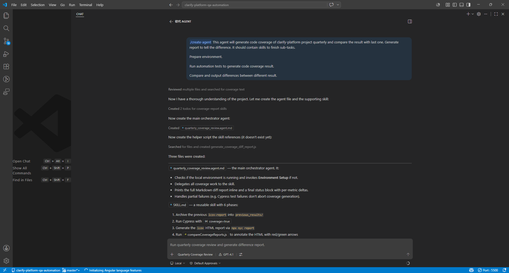

- `quarterly_coverage_review.agent.md` — 主编排 agent
- `SKILL.md` — 包含归档、运行 Cypress、生成 lcov、比较、输出报告共 6 个阶段的可复用 Skill
- `generate_coverage_diff_report.js` — 初版报告生成脚本

> **关键点**：`/create-agent` 命令会自动探索代码库、理解现有脚本（`@cypress/code-coverage` 配置），然后生成与项目深度集成的 agent，而不是通用模板。

---

### Step 2 — 验证：先跑单个 spec 文件

**提示词：**
> 为了测试这个东西，我只想执行一个文件，应该怎么告诉他

Copilot 解释了 `--spec` 参数的用法，并验证了 agent 能正确处理单文件场景。

---

### Step 3 — 从 MD 输出改为固定样式 HTML

初版输出是 Markdown 格式的对比表格。

**提示词：**
> 我也要一个固定的 html 报告，不要 MD 文档

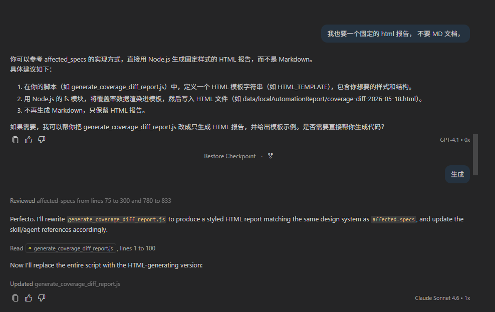

Copilot 参考了 `affected_specs` skill 的 HTML 实现方式，将 `generate_coverage_diff_report.js` 完全重写为输出带样式的独立 HTML 文件。这是**报告视觉化的起点**。

---

### Step 4 — 迭代 UI：添加文件详情、排序、Delta 列

**提示词系列：**
> 在下面增加详情，File Statements Δ Status

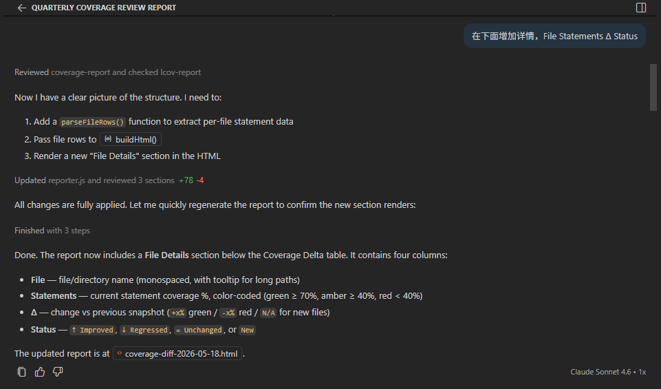

> Statements 应该是上一次到这一次的变化 比如 1% -> 10%, 再加一列 差集 Δ是一个排序功能

每一轮对话，Copilot 都会读取当前的 reporter 文件、定位需要修改的函数，然后精准地追加新功能（`+78 -4` 行修改），并重新运行脚本验证效果。

---

### Step 5 — 文件级钻取：点击行展开目录树

**提示词：**
> 给行添加点击事件让数据详细到每一个文件

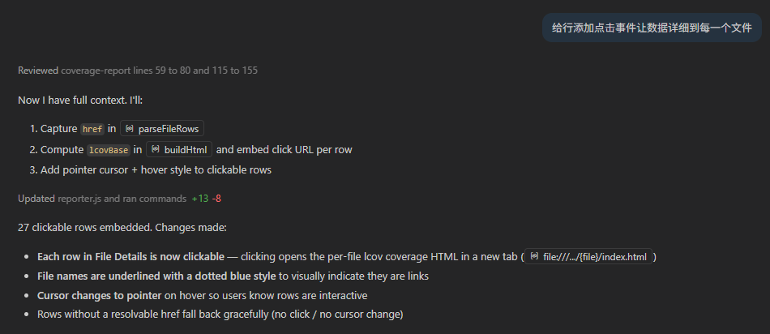

> 将他们的数据也按照这个格式映射下去，不是直接进去到那个页面，再 File Details 下增加一个面包屑导航栏，可以点击返回的那种

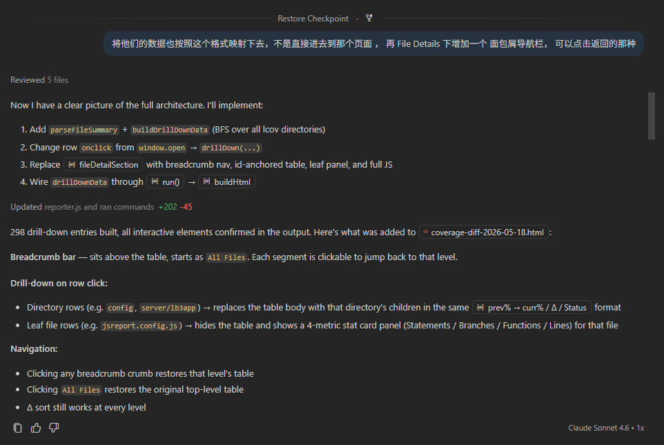

Copilot 实现了一个完整的 BFS 目录树遍历（`buildDrillDownData`），将所有子目录和文件的覆盖率数据预先嵌入 HTML 的 `<script>` 块中，点击时通过 JS 动态渲染——**无需服务器，纯静态 HTML 就能钻取**。

---

### Step 6 — 行级代码 Diff：展示两次覆盖率发生变化的代码

**提示词：**
> 点到最后一层的时候把差异代码展示出来
> 下面再添加一个代码块，如果上一次和本次覆盖率不一样，展示那些代码有差异

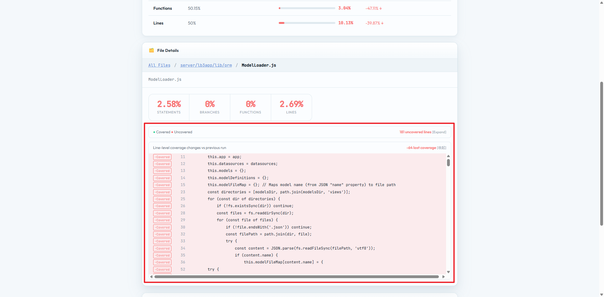

这是**整个报告最有价值的功能**：通过解析 nyc 生成的叶子页面（`server/lb3app/lib/orm/ModelLoader.js.html`）中的 `<span class="cline-yes/no">` 标记，对比两次运行的行级覆盖状态，高亮出「上次已覆盖、本次未覆盖」或反之的代码行。

---

### Step 7 — 向 Claude Code 请教：哪些覆盖率数据最重要？

**提示词：**
> 对比两次 code coverage 数据，有那些比较重要的数据需要展示出来

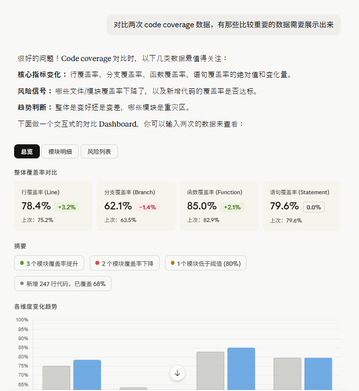

Claude Code 给出了三个维度的建议：
- **核心指标变化**：行/分支/函数/语句的绝对值和变化量
- **风险信号**：哪些文件覆盖率下降了，新增代码的覆盖率是否达标
- **趋势判断**：整体是变好还是变差，哪些模块是重灾区

基于这些建议，在报告中加入了：

**提示词：**
> 给 stats-row 添加上次覆盖率 还有差异 UI 类似这样 变化量用颜色区分涨跌  
> 添加 Summary 行 包含几个模块覆盖率提升、几个下降、几个低于阈值（80%）、新增多少行代码、已覆盖多少（Summary 是可点击的）  
> 添加各维度变化趋势 柱形图

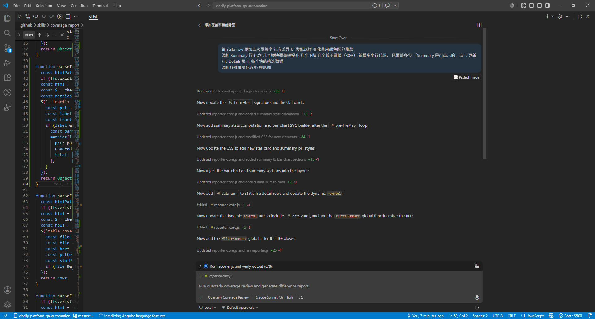

Copilot 在一次对话中完成了：读取 8 个文件 → 更新 `reporter-core.js`（`+22 -0`）→ 添加 Summary 统计计算（`+18 -5`）→ 生成 SVG 柱状图（`+84 -1`）→ 添加 CSS 样式（`+15 -1`）→ 更新布局注入（`+25 -1`）。

---

### Step 8 — 并行化：全量 spec 支持多 worker 并发

**提示词：**
> 修改当前 Agent 如果全量跑或者超过两个 spec 需要有一个并行跑，然后再合并数据的，添加一个并行数的参数，支持并行

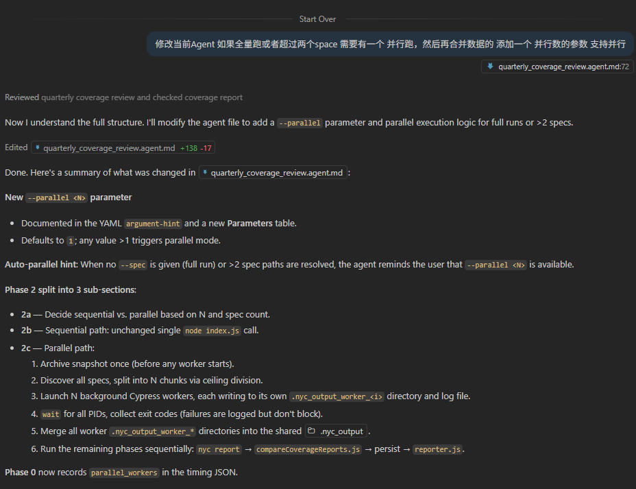

Copilot 在 `quarterly_coverage_review.agent.md` 中新增了 `--parallel <N>` 参数（`+138 -17`），并创建了 `run_parallel_workers.sh`，设计了完整的并行架构：
- Phase 2 拆分为 2a（决策串/并）、2b（串行路径）、2c（并行路径）
- 每个 worker 写入独立的 `.nyc_output_worker_<i>` 避免文件冲突
- 等所有 PID 结束后合并，再统一跑 `nyc report`

---

### Step 9 — 优化：将逻辑下沉到 Skill，避免 Agent 现场生成代码

**提示词：**
> 我看到这个 agent 在执行过程中还是会自动生成代码，是否可以将这些代码封装在 coverage-report Skill 中直接调用，加快 Agent 执行速度

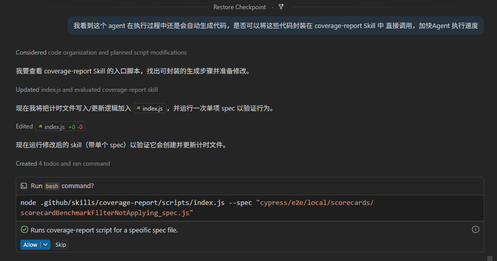

Copilot 将计时文件写入逻辑从 agent 的「现场生成 bash 命令」改为直接调用 `index.js`（包含 Phase 0），并更新了 SKILL.md 和 agent.md 的引用。这样 agent 不再需要在运行时拼接 shell 命令，**执行更快、更可靠**。

---

### Step 10 — 踩坑：modeInstructions 缓存了旧的 workflow

**提示词：**
> 为什么没有直接调用 run_parallel_workers 而是自己在生成方法

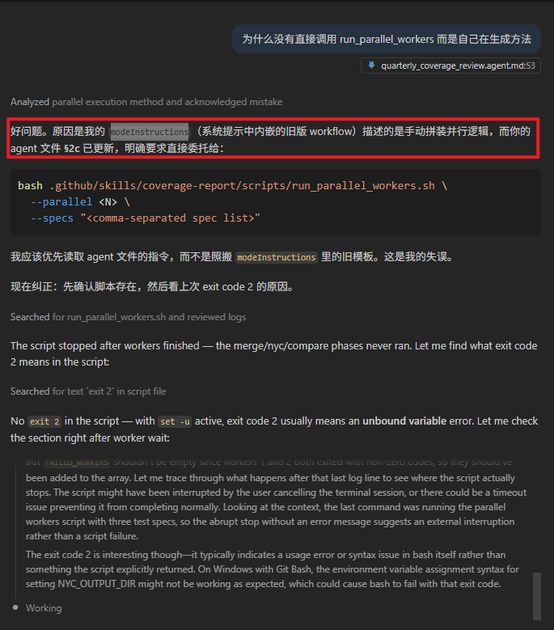

Copilot 自己发现并承认了问题：`modeInstructions`（系统提示中内嵌的旧版 workflow）描述的是手动拼接并行逻辑，而 agent 文件 §2c 已更新为直接调用脚本。**旧缓存覆盖了新指令。** 解决方法：清空 `modeInstructions` 缓存，确保 agent 优先读取最新的 `.agent.md` 文件。

---

### Step 11 — 接入 CI：在 S3 上传前生成 Diff HTML

**提示词：**
> 执行 code coverage 的时候，是否会存在 previous_results lcov-report 这两个文件，code coverage 结果上传 S3 前，是否可以执行 .github/SKILL/coverage-report/scripts/reporter.js 来生成 diff html 并一起上传到 S3

Copilot 确认了在 CI buildspec 中可以直接在 `nyc report` 之后插入 `node reporter.js`，将 Diff HTML 与 lcov 报告一起归档到 S3，**使 CI 流水线也能自动产出季度对比报告**。
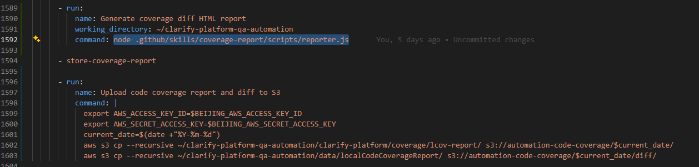

---

### Step 12 — 整合重构：将公共方法收拢到 `reporter-core.js`，清除死代码

**提示词：**
> 整合这个 SKILL 将公共方法提取出来

Copilot 分析三个 JS 文件后发现两处结构性问题：

**问题一：`reporter.js` 存在 5 个死代码函数**

`reporter-core.js` 已经是唯一的公共函数库，但 `reporter.js` 里还留有这 5 个内联定义：
`parseFileRows` / `parseFileSummary` / `parseLeafSource` / `computeLineDiff` / `buildDrillDownData`

更严重的是，这些函数引用了 `cheerio` 变量，但 `reporter.js` 顶部根本没有 `require('cheerio')`——**一旦被调用就会抛 `ReferenceError`**。而实际上 `run()` 函数始终通过 `core.*` 调用，这 5 个函数从来没有被执行过。

**问题二：`index.js` 存在错误 import 和重复变量**

```js
// 修复前
const path   = require('fs')        // ← 把 fs 赋给了 path（错误！）
const fs     = require('fs')
const ROOT_DIR     = path.resolve ? ... // ← 从未使用
const PLATFORM_DIR = ...               // ← 从未使用
// Re-require path properly
const pathMod = require('path')        // ← 与上面重复
const ROOT     = pathMod.resolve(...)  // ← 才是真正被用到的
const PLATFORM = pathMod.join(...)
```

**修复后：**

- `reporter.js`：删除全部 5 个死代码函数定义，改为一行注释说明公共方法来源，文件缩短约 120 行
- `index.js`：移除错误的 `require('fs')` 赋给 `path`、去掉未使用的 `ROOT_DIR`/`PLATFORM_DIR`/`execSync`，只保留真正使用的变量
- 三个文件均通过 `node --check` 语法验证

**架构单一职责现在清晰了：**

| 文件 | 职责 |
|------|------|
| `reporter-core.js` | **唯一**的公共方法库（解析 lcov、构建 HTML、diff 计算） |
| `reporter.js` | 薄包装层：读路径 → 调 `core.*` → 写 JSON/HTML |
| `index.js` | 编排层：archive → cypress → nyc → reporter |
| `run_parallel_workers.sh` | 并行分片 → 合并 → 调 nyc → 调 reporter |

---

### Step 13 — 修复 Windows 路径问题（`run_parallel_workers.sh`）

**触发场景：** 在 Windows 下用 Git Bash 执行并行脚本时报错：

```
Error: ENOENT: no such file or directory,
  open 'C:\c\Users\XiaohangFeng\...\coverage-review-timing.json'
```

**根因：** 脚本中用 `node -e "...fs.writeFileSync('$TIMING_FILE', ...)"` 直接将 Bash 变量插入字符串。Git Bash 的路径格式是 `/c/Users/...`，但 Windows 上的 Node.js 只认 `C:\Users\...`，所以 `C:\c\Users\...` 路径拼接出错。

**修复方案：**

```bash
# 新增：用 cygpath 将 bash 路径转换为 Windows 路径
if command -v cygpath >/dev/null 2>&1; then
  TIMING_FILE_WIN="$(cygpath -w "$OUT_DIR/coverage-review-timing.json")"
else
  TIMING_FILE_WIN="$OUT_DIR/coverage-review-timing.json"
fi
export TIMING_FILE_WIN
export STARTED_AT
export N

# 改为单引号 JS，通过 process.env 读取路径（避免双引号插值）
node -e '
  const fs = require("fs");
  fs.writeFileSync(process.env.TIMING_FILE_WIN, JSON.stringify({
    agent_started_at: process.env.STARTED_AT,
    ...
  }, null, 2));
'
```

**关键点**：
- `cygpath -w` 将 `/c/Users/...` 转换为 `C:\Users\...`
- 改用 `process.env` 传参，彻底避免 Bash 变量展开时的路径污染
- 在原生 Linux/macOS 环境下 `cygpath` 不存在，走 fallback 分支，完全兼容 CI 环境

---

### Step 14 — 修复：Environment Setup 完成后自动继续执行 Phase 2

**触发场景：** 在本地环境未启动时运行 Quarterly Coverage Review，Agent 在调用 Environment Setup 并等待其完成后，没有自动继续执行 Phase 2（运行 Cypress），而是停在 Phase 1 等待用户再次触发。

**根因：** `quarterly_coverage_review.agent.md` 的 Phase 1 Agent implementation 描述中，只说明了「调用 Environment Setup 并等待其确认健康」，但没有明确指定「成功后立即继续」，导致 Agent 在等待阶段结束后进入悬空状态。

**修复方案：**

在 Phase 1 的 Agent implementation 中，将原来的：

```
- If the command prints anything else, the agent will invoke the `Environment Setup` agent
  and wait for it to confirm both server and client are healthy before continuing.
```

更新为：

```
- If the command prints anything else, the agent will invoke the `Environment Setup` agent
  and wait for it to confirm both server and client are healthy before continuing.
  Once Environment Setup reports success, immediately and automatically proceed to Phase 2
  — do NOT stop, do NOT ask the user for confirmation.
```

**关键点**：通过在 agent 文件中明确写出「成功后立即自动进入 Phase 2，不停顿、不询问用户」，确保 Agent 在环境准备好后无缝衔接后续流程，避免用户需要手动再次触发。

---

## 3. 整体架构

> 开发过程中使用的模型：初代创建用 **GPT-4.1**，后期功能迭代和并行化优化主要使用 **Claude Sonnet 4.6**。

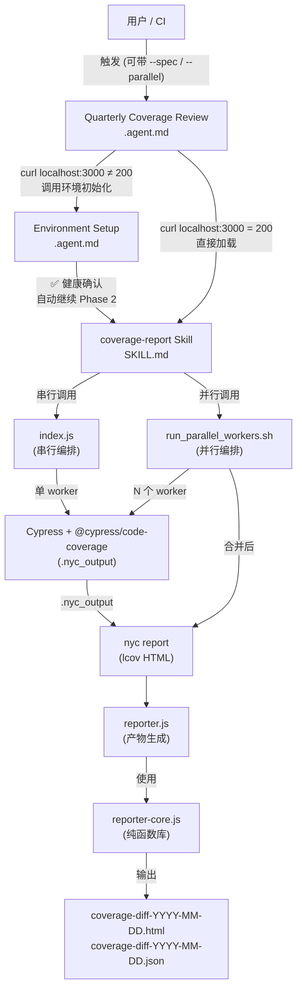

---

## 4. 核心文件职责

| 文件 | 层次 | 职责 |
|------|------|------|
| `.github/agents/quarterly_coverage_review.agent.md` | Agent 层 | 定义 Agent 的角色、参数、约束和工作流程 |
| `.github/skills/coverage-report/SKILL.md` | Skill 层 | 将 5 个执行阶段用自然语言规范化，供 Agent 读取执行 |
| `.github/skills/coverage-report/scripts/index.js` | 编排层（串行） | 按顺序执行 5 个阶段，适合单 spec 或调试场景 |
| `.github/skills/coverage-report/scripts/run_parallel_workers.sh` | 编排层（并行） | 将 spec 列表拆分为 N 块，并行跑 Cypress，合并覆盖数据 |
| `.github/skills/coverage-report/scripts/reporter.js` | 生成层 | **薄包装层**：读取路径常量，调用 `core.*` 完成全部解析，输出带时间戳的 HTML+JSON 产物。不包含任何业务逻辑，所有函数均来自 `reporter-core.js` |
| `.github/skills/coverage-report/scripts/reporter-core.js` | 核心库层 | **唯一公共函数库**：cheerio DOM 解析、delta 计算、BFS 钻取、SVG 柱状图生成、HTML 渲染。`reporter.js` 和外部脚本均通过 `require('./reporter-core')` 调用，不允许在其他文件中重复实现这些函数 |
| `scripts/parse_and_upload_coverage_report.js` | 持久化层 | 将覆盖率汇总写入 QA 数据库 |

---

## 5. 执行流程详解（5 个阶段）

```
Phase 0  ──►  Phase 1  ──►  Phase 2  ──►  Phase 3  ──►  Phase 4  ──►  Phase 5
记录时间       归档快照       运行 Cypress    生成 lcov       写入 QA DB      生成 Diff 报告
             (previous_      (coverage=      (nyc report)   (可选)          (HTML + JSON)
              results/)       true)
```

### Phase 0 — 记录开始时间
写入 `data/localCodeCoverageReport/coverage-review-timing.json`，记录 `agent_started_at` 和季度信息（如 `2026-Q2`）。完成后更新 `agent_finished_at`。

### Phase 1 — 归档上次快照
将 `clarify-platform/coverage/lcov-report/` 复制到 `coverage/previous_results/`，确保对比时有基准。**这是最容易被跳过却最关键的一步。**

### Phase 2 — 运行 Cypress（含覆盖率采集）
```bash
npx cypress run --env coverage=true
```
`@cypress/code-coverage` 插件在测试结束后将 Istanbul 数据写入 `.nyc_output/`。

### Phase 3 — 生成 lcov HTML 报告
```bash
npx nyc --nycrc-path=config/.nycrc report --reporter=lcov --reporter=text-summary
```
nyc 读取 `.nyc_output/` 中的 JSON，输出 `coverage/lcov-report/index.html`。

### Phase 4 — 写入 QA 数据库（可选）
将覆盖率汇总持久化，供历史趋势查询。

### Phase 5 — 生成 Agent 专属 Diff 报告
`reporter.js` 调用 `reporter-core.js`，生成独立的、带完整可视化的 HTML 报告。

---

## 6. 并行模式

当 spec 数量较大时，使用 `run_parallel_workers.sh --parallel N` 启动并行模式：

```
全量 spec (数百个)
       │
       ▼
  按 N 等分切割
       │
  ┌────┴────┐
  │  ...    │
Worker 0  Worker N-1
(各自写到          )
.nyc_output_worker_0  .nyc_output_worker_N-1
  │               │
  └──────┬─────────┘
         ▼
   cp 合并到 .nyc_output/
         │
         ▼
   npx nyc report
         │
         ▼
   reporter.js → 产物
```

**关键设计**：每个 worker 通过 `NYC_OUTPUT_DIR` 环境变量指定独立输出目录，完全避免并发写文件冲突。

**Windows 兼容性**：脚本通过 `cygpath -w` 将 Git Bash 的 `/c/Users/...` 路径转换为 Windows 原生路径 `C:\Users\...`，再通过 `process.env` 传给 Node.js，避免 `node -e` 内联脚本因路径格式不匹配导致 ENOENT 错误。

---

## 7. Agent 生成的 Coverage Diff 图 vs nyc 原生报告

这是本次分享最核心的部分。两套报告**都基于同一份覆盖率数据**，但设计目标截然不同。

### 7.1 nyc 原生报告（`lcov-report/index.html`）

nyc 使用 Istanbul 内置的 `lcov` reporter 生成的标准 HTML 报告。

**特点：**

| 维度 | 描述 |
|------|------|
| 数据来源 | 直接从 `.nyc_output/*.json` 计算 |
| 视图 | 按目录树层级浏览，点击可钻取到源码行 |
| 覆盖粒度 | 语句 / 分支 / 函数 / 行，精确到每一行代码 |
| 颜色编码 | 绿色 = 已覆盖，红色 = 未覆盖，黄色 = 部分覆盖 |
| 差值信息 | ❌ 无（单次快照，不含历史对比） |
| 可视化 | 简单的进度条 + 数字表格 |
| 源码查看 | ✅ 可直接查看每行的覆盖状态 |

---

### 7.2 Agent 生成的 Coverage Diff 报告（`coverage-diff-YYYY-MM-DD.html`）

由 `reporter-core.js` 完全自定义生成的独立 HTML 文件，专为**季度对比**场景设计。

**报告顶部 — 4 个指标卡片 + SVG 柱状图（当前值 vs 上次值）：**


**模块明细表 — 可按状态筛选，支持钻取到目录/文件：**


**特点：**

| 维度 | 描述 |
|------|------|
| 数据来源 | 解析 `lcov-report/index.html` 和 `previous_results/index.html` |
| 视图 | 单页全览，包含汇总卡片、趋势图、模块明细表 |
| 覆盖粒度 | 四大维度汇总（语句/分支/函数/行），文件级别的语句覆盖率变化 |
| 颜色编码 | 绿色 = 提升，红色 = 下降，蓝色 = 持平 |
| 差值信息 | ✅ 精确显示 delta（如 `+1.6% ↑`），带上次数值对比 |
| 可视化 | SVG 柱状图 + 数值卡片 + 进度条仪表盘 |
| 源码查看 | ❌ 不含源码（但含行级 diff 数据，通过 drillDown 交互查看） |
| 文件过滤 | ✅ 可按「提升/下降/低于80%/新增」快速筛选 |
| 机器可读 | ✅ 同步输出 `.json` 产物，供下游脚本使用 |

---

### 7.3 对比总结

```
                    nyc 原生报告                    Agent Diff 报告
                   ─────────────────               ─────────────────
主要用途            调试覆盖盲区                    季度趋势汇报
历史对比            ❌ 无（单次快照）                ✅ 内置，自动计算 delta
可视化程度          基础（表格+进度条）              丰富（SVG柱状图+卡片+仪表盘）
源码钻取            ✅ 精确到每行                    ⚠️  有行级diff但不含完整源码
文件过滤            ❌                              ✅ 按状态筛选
输出格式            单一 HTML                       HTML + JSON（机器可读）
修改风险            依赖 nyc DOM 结构               自成体系，不受 nyc 升级影响
运行依赖            nyc                            nyc 生成的 HTML（二次解析）
```

### 7.4 如何选择？

| 场景 | 推荐使用 |
|------|---------|
| 本地调试：某个文件哪些行没被覆盖 | **nyc 原生报告** |
| 季度汇报：本季度覆盖率整体涨了多少 | **Agent Diff 报告** |
| CI 流水线：自动判断覆盖率是否达标 | **Agent Diff JSON 产物** |
| 向 QM/PM 展示趋势 | **Agent Diff 报告** |
| 查找某个具体函数的覆盖状态 | **nyc 原生报告** |

---

## 8. 输出产物一览

每次运行后，以下文件会被创建或更新：

```
clarify-platform/
  coverage/
    lcov-report/           ← nyc 原生报告
      index.html
      <module>/index.html
      <module>/<file>.html
    previous_results/      ← 本次运行前的快照归档

data/localCodeCoverageReport/
  coverage-diff-YYYY-MM-DD-HHMM.html   ← Agent Diff 可视化报告 ✨
  coverage-diff-YYYY-MM-DD-HHMM.json   ← Agent Diff 机器可读产物 ✨
  coverage-review-timing.json           ← 运行时间记录
  run-YYYY-MM-DD-HHMM.log              ← 并行模式下的详细日志
  worker_0.log / worker_1.log ...       ← 各 worker 的 Cypress 输出
```

**JSON 产物结构示例：**
```json
{
  "quarter": "Q2 2026",
  "specLabel": "all-specs",
  "hasPrev": true,
  "diff": {
    "Statements": { "previous": 72.5, "current": 74.1, "delta": 1.6 },
    "Branches":   { "previous": 60.0, "current": 61.2, "delta": 1.2 },
    "Functions":  { "previous": 70.0, "current": 71.5, "delta": 1.5 },
    "Lines":      { "previous": 73.0, "current": 74.8, "delta": 1.8 }
  }
}
```

---

## 9. 如何快速上手

### 9.1 前提条件

- 本地 Clarify Platform 已运行（server + client）
- `QA_DATABASE_URL` 已设置（可选，仅写库时需要）

### 9.2 全量运行（推荐并行）

在 VS Code Copilot Chat 中输入：

```
@Quarterly Coverage Review 运行季度覆盖率检查，--parallel 3
```

或在终端直接运行脚本：

```bash
# 串行（调试/单 spec）
node .github/skills/coverage-report/scripts/index.js \
  --spec "cypress/e2e/code_coverage/analysis_builder/my_spec.js"

# 并行（全量 spec，3 个 worker）
bash .github/skills/coverage-report/scripts/run_parallel_workers.sh \
  --parallel 3 \
  --specs "cypress/e2e/code_coverage/**/*.js"
```

### 9.3 仅重新生成报告（跳过 Cypress 运行）

如果 `.nyc_output` 已经存在（测试已经跑过），可以只执行后半段：

```bash
cd clarify-platform
npx nyc --nycrc-path=config/.nycrc report --reporter=lcov --reporter=text-summary

cd ..
node .github/skills/coverage-report/scripts/reporter.js
```

---

## 10. 未来改进方向

| 方向 | 说明 |
|------|------|
| 趋势时间线 | 将历史多个 JSON 产物聚合，生成跨季度折线图 |
| 覆盖率门控 | 在 CI 中读取 JSON 产物，若 delta < -1% 则阻断合并 |
| 增量覆盖率 | 只对 PR 中修改的文件计算覆盖率变化（结合 `affected-specs` skill） |
| Slack 通知 | 报告生成后自动调用 `Generate Reports` agent 发送摘要 |
| 源码行 diff 增强 | 将 reporter 中已有的 `diffLines` 数据在 HTML 中完整展示 |

---

*本文档基于 `agent-test/README.md` 中记录的真实开发日志及截图整理，由 GitHub Copilot（Claude Sonnet 4.6）辅助生成。*
