### 1.0
#### 1 init Agent 

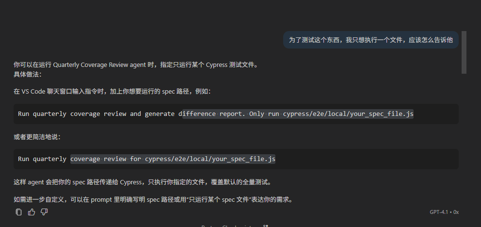
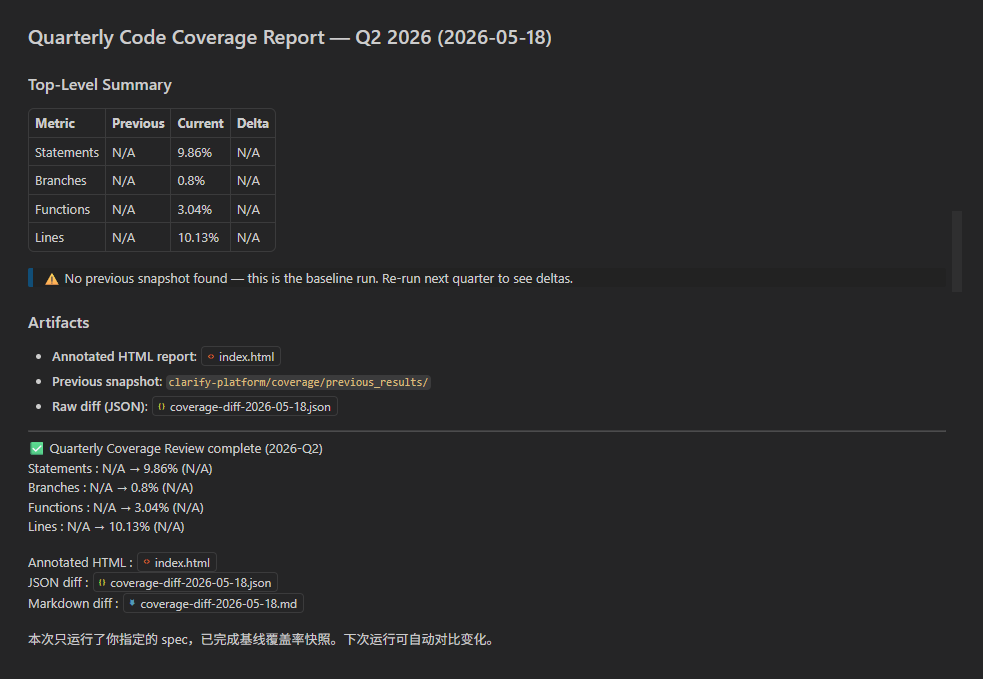
去抄
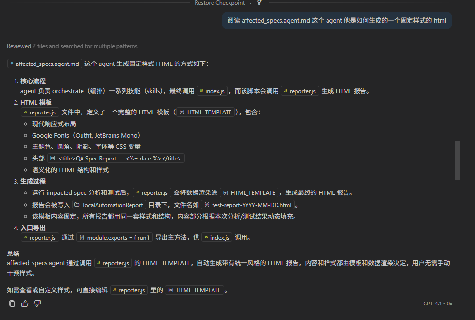
用抄到到的知识，生成自己的模板

#### 2. 添加功能 优化 UI
 添加排序 上一个版本和当前版本差异 每个文件都有详情页面（展示两个， 一个是未覆盖代码， 一个差异代码 ）代码量太大添加展开折叠（默认折叠
添加详情， 

增加描述， 修改bug
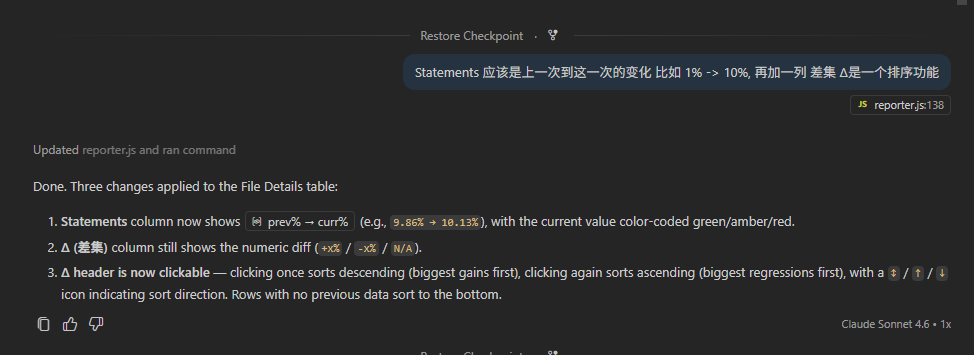
给行添加点击事件让数据详细到每一个文件

将他们的数据也按照这个格式映射下去，不是直接进去到那个页面 ， 再 File Details 下增加一个 面包屑导航栏， 可以点击返回的那种

点到最后一层的时候把差异代码展示出来
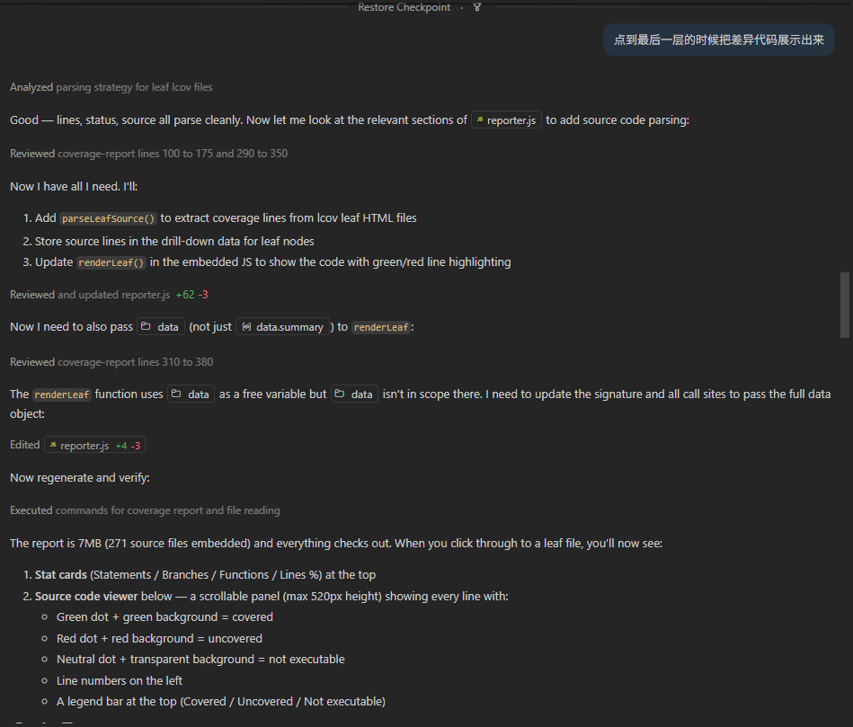
下面再添加一个代码块， 如果上一次和本次覆盖率不一样，展示那些代码有差异，
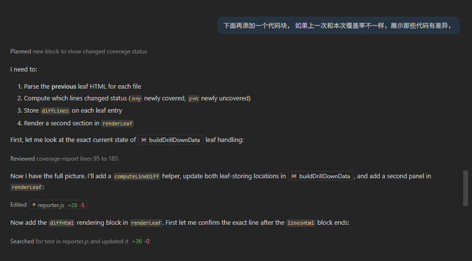
动态切换展开和收起
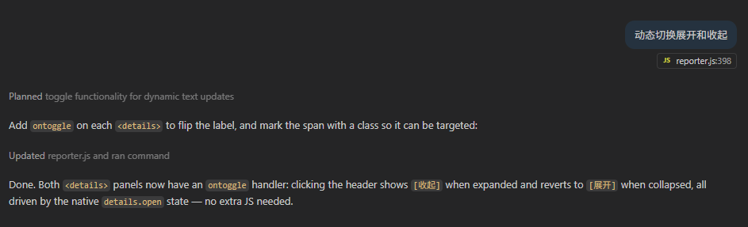
#### [👉 第一版本 结束](./html/1.html)
唯一亮点， 能看到 两次 code coverage 产生差异的代码
 
#### 3. 问 Claude Code 对比两次 code coverage 数据，有那些比较重要的数据需要展示出来

给 stats-row 添加上次覆盖率 还有差异 UI 类似这样 变化量用颜色区分涨跌

添加 Summary 行 包含 
  - 几个模块覆盖率提升 
  - 几个下降 
  - 几个低于阈值（80%） 
  - 新增多少行代码， 
  - 已覆盖多少 
（Summary 是可点击的，点击 更新 File Details 展示 每个块的筛选数据

添加各维度变化趋势 柱形图

#### [👉 添加新功能](./html/2.html)
1. 新增差异
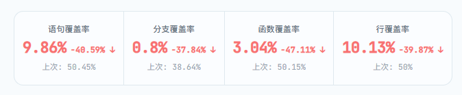
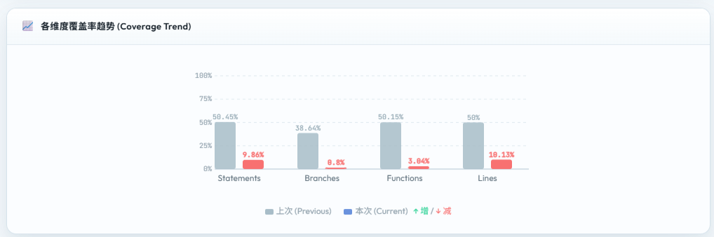
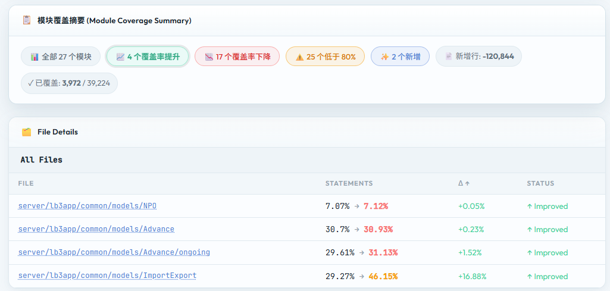

#### 并行执行测试 
Run quarterly coverage review and generate difference report. `specPath` `parallel`
修改当前Agent 如果全量跑或者超过两个space 需要有一个 并行跑，然后再合并数据的 添加一个 并行数的参数 支持并行

#### 4. 优化JS 执行命令
 初代的执行方法这个样子， 后面传了文件名 ， 给他默认文件名， 没传显示 all-specs， 可以直接使用 node ./.github/skills/coverage-report/scripts/reporter.js 生成 Diff Html
node -e "var r=require('./.github/skills/coverage-report/scripts/reporter.js'); r.run({specLabel:'journey_sequence_sunburst_code_cover_age_spec.js'})" 2>&1

#### 优化 Agent
我看到这个 agent 在执行过程中还是会自动生成代码，是否可以将这些代码封装在 coverage-report Skill 中 直接调用，加快Agent 执行速度
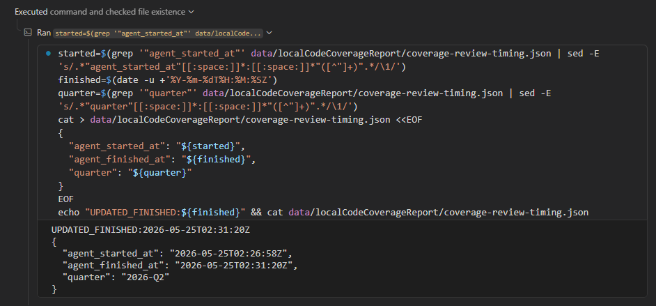

xcopy/cp 产生大量的操作，感觉会影响性能  ，
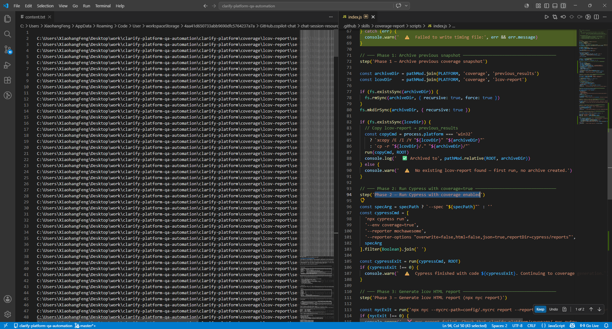

#### 缓存问题
添加清空 modeInstructions 缓存方法

#### 5 创建 Github Actions 运行 Copilot Agent
 因为 没了解 Copilot 怎么在 CI 中运行，使用 Github Actions 运行，生成了 Github Actions 脚本（未测试

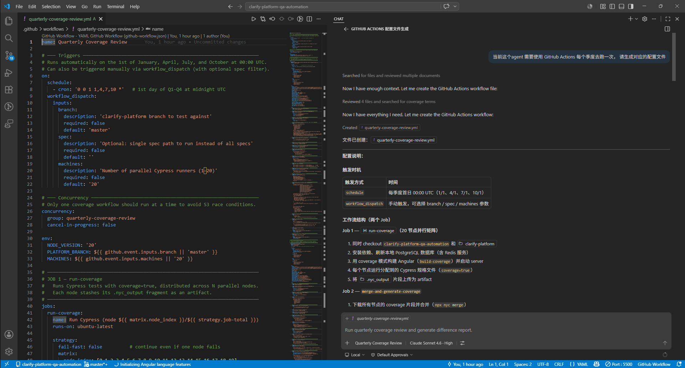
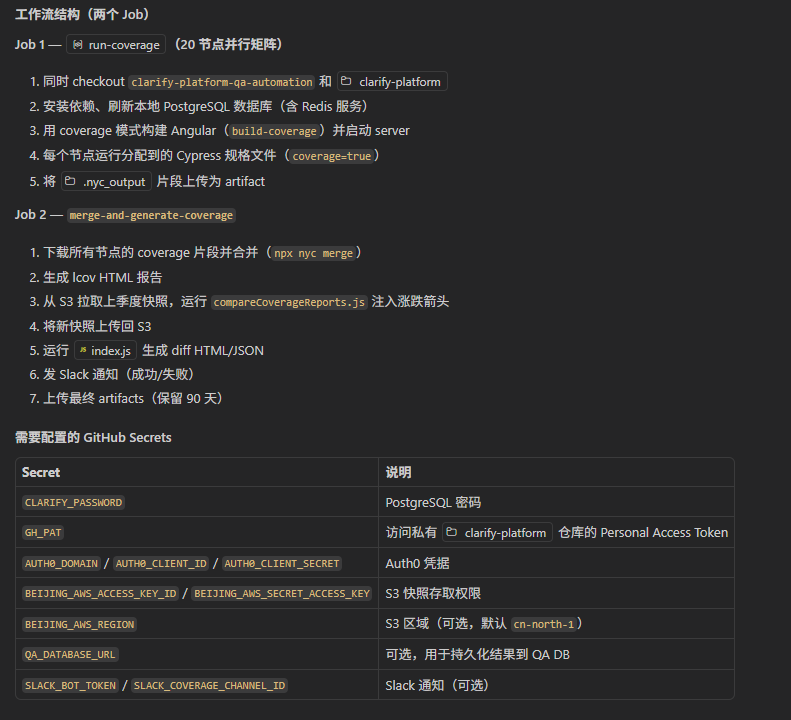

#### 6 CI 中 生成 Diff HTML
 可以直接用 reporter.js 对比两个结果，在coverage 结果上传 S3 前运行reporter.js ，生成Diff HTML ,一起上传到 S3 
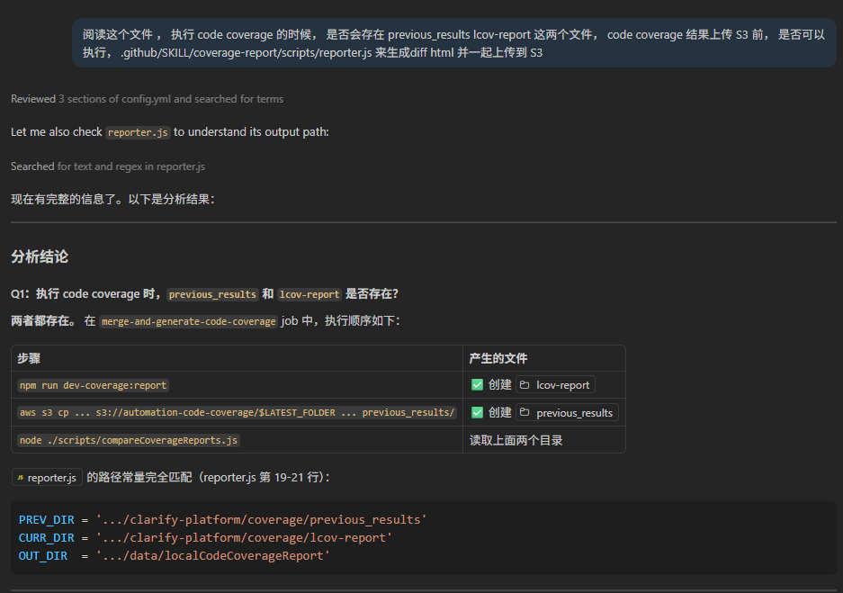
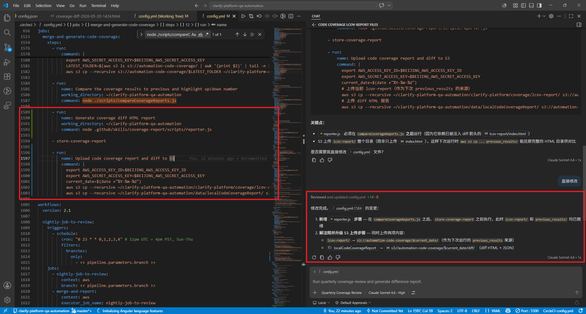
