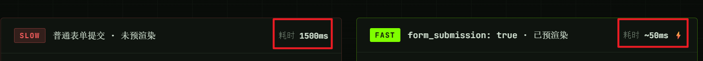

## 参考链接

- [Chrome 145 Blog](https://developer.chrome.com/blog/new-in-chrome-145) | [Release Notes](https://developer.chrome.com/release-notes/145)
- [Chrome 146 Blog](https://developer.chrome.com/blog/new-in-chrome-146) | [Release Notes](https://developer.chrome.com/release-notes/146)
- [Chrome 147 Blog](https://developer.chrome.com/blog/new-in-chrome-147) | [Release Notes](https://developer.chrome.com/release-notes/147)

## Chrome 145（2026 年 2 月）
 
### 性能

#### 1. 导航性能置信度字段（`confidence`）

`PerformanceNavigationTiming` 新增 `confidence` 字段，帮助开发者判断当前采集到的导航性能数据是否有代表性（区分冷启动与热启动等双峰分布场景）。

#### 2. 性能条目新增 `paintTime` 和 `presentationTime`

在 Element Timing、LCP、Long Animation Frames、Paint Timing 中新增：
- `paintTime`：渲染阶段结束、浏览器开始绘制的时间点
- `presentationTime`：像素实际到达屏幕的时间点

### 存储

#### 1. IndexedDB：内存上下文切换到 SQLite 后端

隐身模式等内存上下文中，IndexedDB 的底层实现已从 LevelDB + 扁平文件迁移到 SQLite，提升可靠性与性能。Web API 无变化。

---

## Chrome 146（2026 年 3 月）

### Origin Trial（实验特性）

#### 1. WebNN（Web Neural Network API）

允许 Web 应用调用操作系统原生 ML 服务和底层硬件能力（CPU/GPU/NPU），在浏览器内实现高效、可靠的机器学习推理。

#### 2. CPU Performance API

暴露设备 CPU 算力信息，可与 Compute Pressure API 结合使用，让应用根据设备性能动态调整计算密度。

#### 3. 预测规则（Speculation Rules）`form_submission` 字段

允许在 `prerender` 的 speculation rules 中声明 `form_submission` 字段，预加载表单提交后的目标页面（如搜索结果页）。
提升页面加载速度 

## Chrome 147（2026 年 4 月）

### 网络 / 本地网络访问（LNA）

#### 1. `Request.isReloadNavigation` 属性

Fetch API `Request` 新增只读布尔属性 `isReloadNavigation`，在 Service Worker 的 `FetchEvent` 中可判断当前请求是否由用户触发的页面刷新引起。
