### UI/UX Pro Max 重构Kenko Blog 2.0

#### **UI/UX Pro Max** 是做什么的
（Antigravity Kit）是一个面向 AI 编程助手（如 Copilot、Claude Code、Cursor 等）的设计智能工具包。它为 Web 和移动端 UI/UX 设计提供了可搜索的数据库，包括：
- 67 种 UI 风格（如玻璃拟态、极简、野兽派等）
- 161 套行业色彩方案
- 57 组字体搭配（含 Google Fonts 导入）
- 161 种产品类型的设计推理规则
- 99 条 UX 最佳实践与反模式
- 25 种图表类型及推荐库
- 10+ 技术栈（React、Next.js、Vue、Svelte、Tailwind、shadcn/ui、SwiftUI、Flutter 等）

它可以：
- 智能生成完整的设计系统（色彩、字体、风格、布局、动画、可访问性等）
- 针对你的产品类型和技术栈，推荐最佳 UI/UX 方案
- 检查和优化现有 UI 代码的体验、可访问性和一致性
- 通过 CLI 或 AI 助手自动集成到你的项目
#### 如何用它重构你的项目 UI？
##### 1. 安装 CLI 工具
```bash
npm install -g uipro-cli
```
##### 2. 在你的项目目录初始化（适配 Copilot agent）

```bash
cd /path/to/your/project
uipro init --ai copilot
```
这会自动生成适配 Copilot 的设计智能 PROMPT.md 文件和模板。
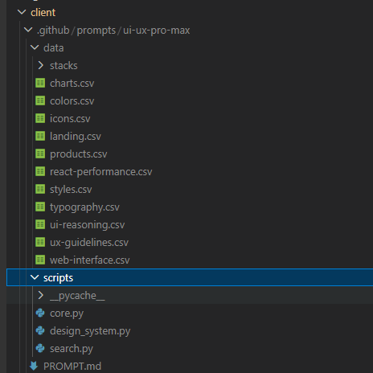


作品集/个人创意，个人作品集，项目，展示，作品 动态驱动 + 极简主义 粗野主义，Aurora UI 叙事驱动 不适用 - 个人品牌 品牌主要 + 艺术诠释 作品展示。个性闪耀。
Portfolio/Personal  creative, personal, portfolio, projects, showcase, work	Motion-Driven + Minimalism	Brutalism, Aurora UI	Storytelling-Driven	N/A - Personal branding	Brand primary + artistic interpretation	Showcase work. Personality shine through.

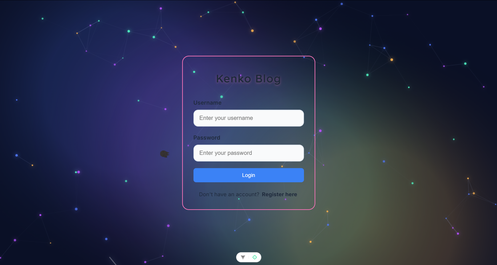


游戏娱乐、电子竞技、游戏、3D 和超写实 + 复古未来主义动态驱动、鲜艳且功能丰富的方块展示 N/A - 专注于游戏 鲜艳 + 霓虹 + 沉浸式色彩 沉浸感优先。性能至关重要。
Gaming	entertainment, esports, game, gaming, play	3D & Hyperrealism + Retro-Futurism	Motion-Driven, Vibrant & Block	Feature-Rich Showcase	N/A - Game focused	Vibrant + neon + immersive colors	Immersion priority. Performance critical.

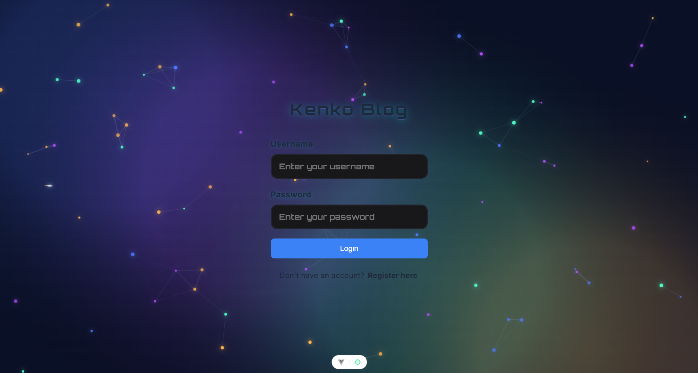


生产力工具协作、生产力、项目、任务、工具、工作流程扁平化设计 + 微交互极简主义、柔和的用户界面演进交互式产品演示钻取分析清晰的层级结构 + 功能性颜色易于使用。注重速度和效率。
Productivity Tool	collaboration, productivity, project, task, tool, workflow	Flat Design + Micro-interactions	Minimalism, Soft UI Evolution	Interactive Product Demo	Drill-Down Analytics	Clear hierarchy + functional colors	Ease of use. Speed & efficiency focus.

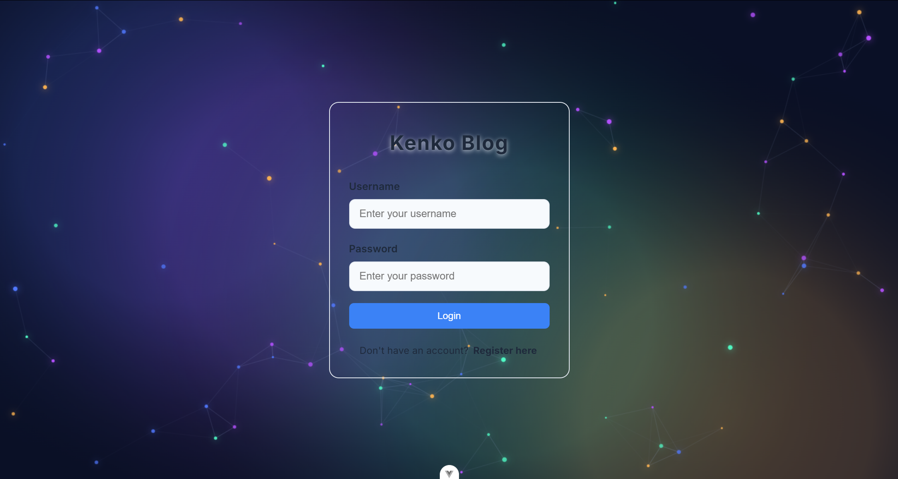


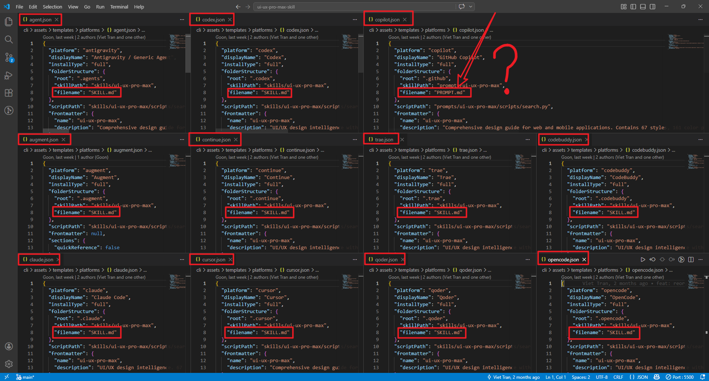
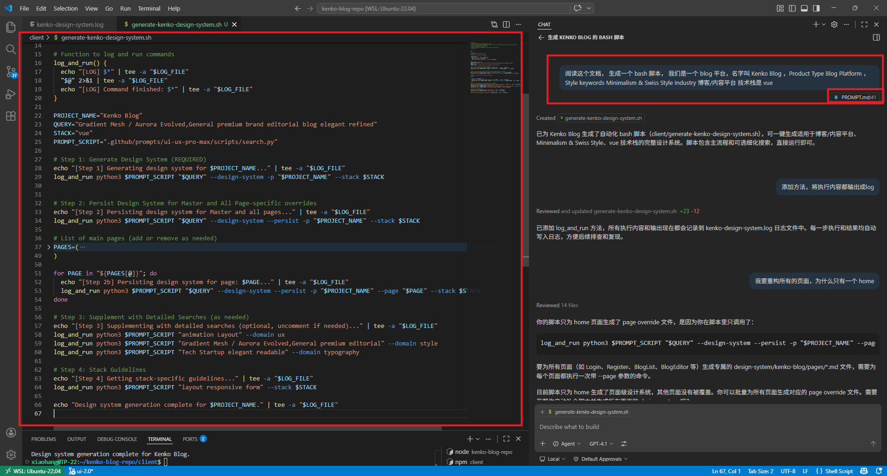
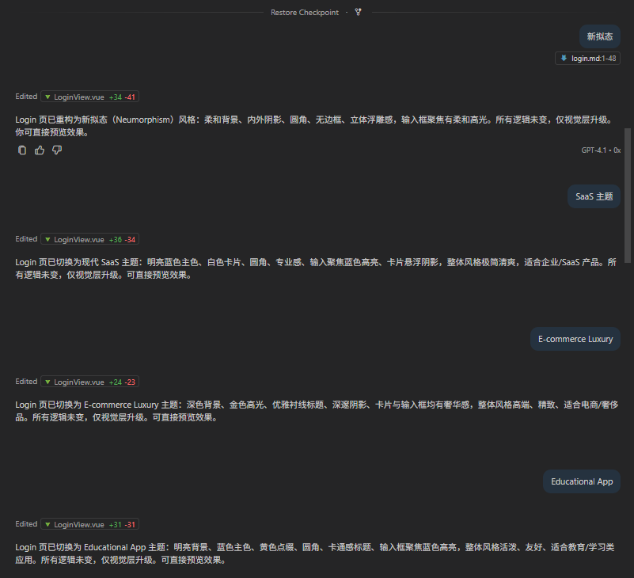
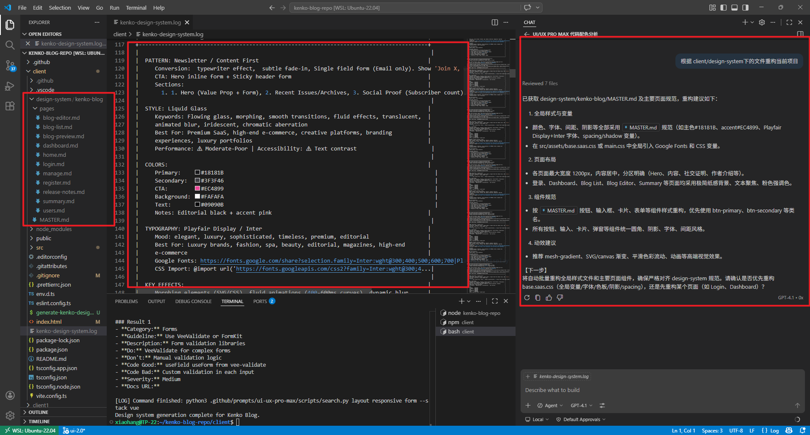
逻辑迁移
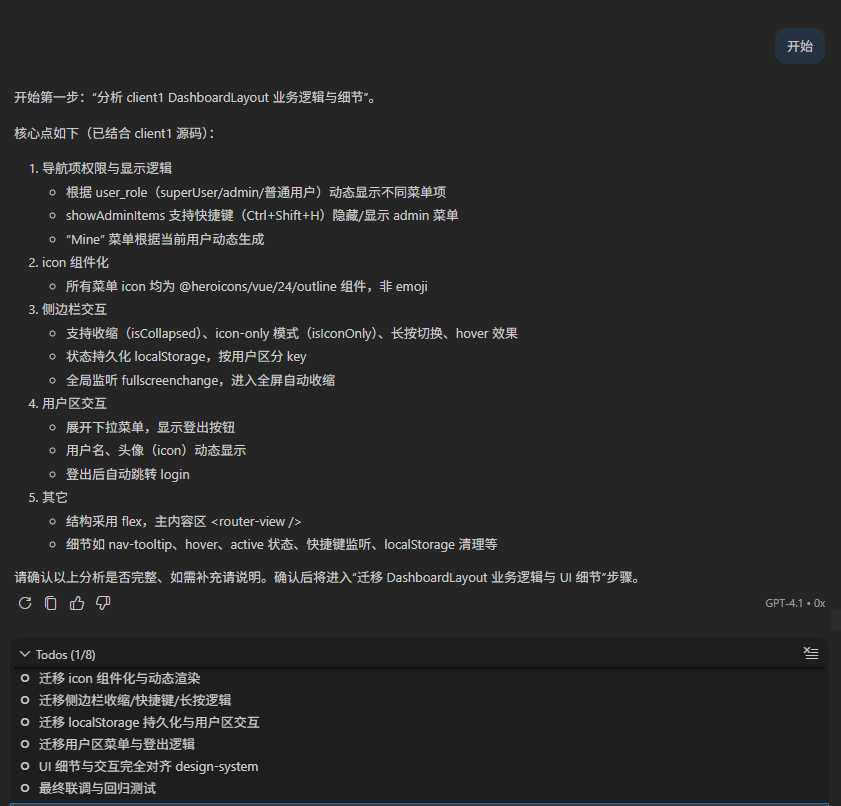


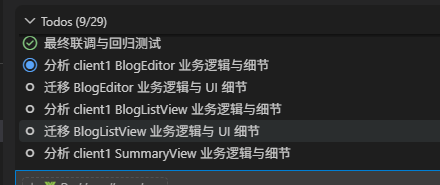


### 新发现
如何更好的使用 AI 
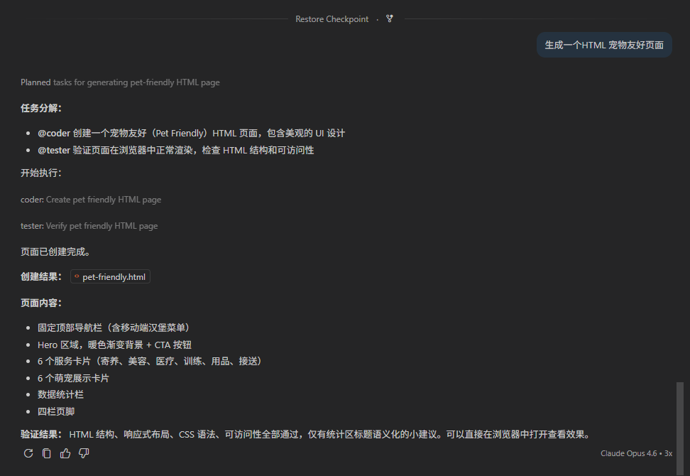
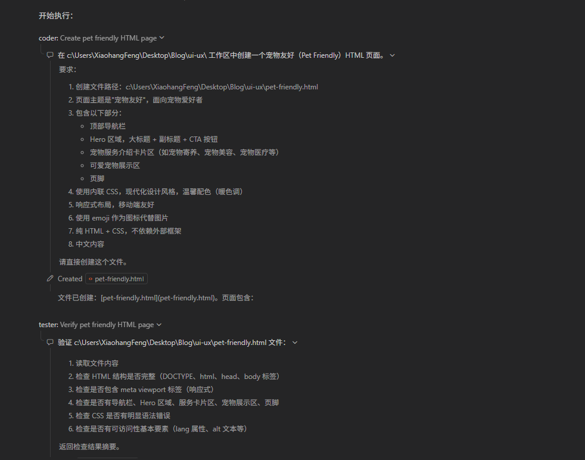
