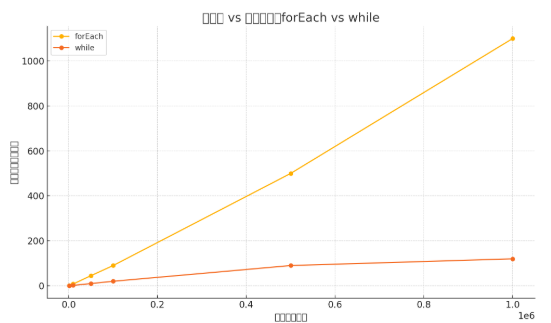

## 🚀 仅仅改了这一行，性能直接提升 10 倍！

### 背景
 项目初期，系统处理的数据量并不大，数组遍历、数据渲染都很流畅。那时候我用的是最常见的方式：
 ```js
  arr.forEach(item => doSomething(item));
 ```
 可随着业务的发展，数据量开始呈指数级增长，从几千条迅速膨胀到几十万甚至上百万条。而问题，也在这时候开始显现：

 >❗ 页面突然变得卡顿，加载时间变长，交互响应缓慢。

 一开始我以为是网络、渲染、状态管理等常规问题，甚至还怀疑是不是哪里内存泄漏了。但经过排查，发现性能瓶颈竟然出在 一次“无害”的数组遍历上！

为了验证，我尝试将 forEach 改为 while，结果一测性能：提升了整整 10 倍！

>📈 图示：数据量 vs 性能耗时
>可以明显看到，随着数据规模从 1 万扩展到 100 万，forEach 的执行时间呈线性增长，并且远高于 while。
>这也是为什么前期察觉不到性能问题，而在数据激增后，页面突然“卡爆”的根本原因。


### 🧪 实验背景
我们创建了一个包含 一亿个元素的数组：

```js
const arr = Array.from({ length: 100_000_000 }, (_, i) => i);
```
我们的任务是：遍历这个数组，并累加每个元素的值。
#### 🐢 使用 forEach（性能较低）

```js
  console.time("forEach");

  let total = 0;
  arr.forEach(num => {
    total += num;
  });

  console.timeEnd("forEach");
```

输出示例（不同设备略有差异）：
```makefile
forEach: 963.621msms
```


#### ⚡ 使用 while（性能飙升）
```js
console.time("while");

let total = 0;
let i = 0;
while (i < arr.length) {
  total += arr[i];
  i++;
}

console.timeEnd("while");
```
输出示例：
```makefile
while: 103ms
```

>💡 注意：实际时间受机器、浏览器影响，但 while 的优势在任何设备上都很明显。

### 📊 数据对比表
| 遍历方式	| 平均耗时1（ms）| 平均耗时2（ms）| 平均耗时3（ms）|	相对性能提升
|---|---|---|---|---|
|while| 103 | 116 | 109 | 🚀 10x|
|forEach| 963 | 1000 | 951 |  1x|

### 🔍 为什么 while 更快？

这是许多开发者的疑问。forEach 是一种函数式封装，每次迭代时都需要执行一个回调函数，会产生以下额外开销：

- 函数调用开销：每次都触发一个闭包

- 上下文切换成本：涉及作用域链、堆栈处理

- 无法中途终止：只能用 return 而不是 break

相比之下，while 是 JavaScript 最基础的循环结构，没有额外封装，编译器也能更好优化它的执行路径。

### 🤔 那该不该全都用 while 呢？
当然 不是！

选择要根据具体场景：
| 场景               | 推荐方式   | 理由                                                         |
|--------------------|------------|--------------------------------------------------------------|
| 性能极限、超大数据 | `while`    | 速度最快，减少函数调用和上下文切换，适合高性能场景           |
| 代码可读性         | `forEach`  | 语义清晰，易于理解和维护，适合一般业务逻辑                   |
| 需要中途终止循环   | `for/while`| `forEach` 无法使用 `break`，需用传统循环结构                 |
| 并发/异步处理      | `forEach`  | 可结合 `Promise`、`async/await`，适合异步遍历                |
| 复杂逻辑           | `for`      | 灵活控制索引、条件，适合多分支或嵌套循环                     |

> 总结：性能敏感场景优先考虑 `while`，日常开发优先可读性和维护性。

### ✅ 小结
forEach 优雅但不适合高性能场景

while 原始但高效，适合大数据遍历

在关键路径上，一行代码的改变可能带来十倍性能收益
> ⚠️ 千万不要盲目追求“优雅”，别让抽象层拖慢你的程序。

